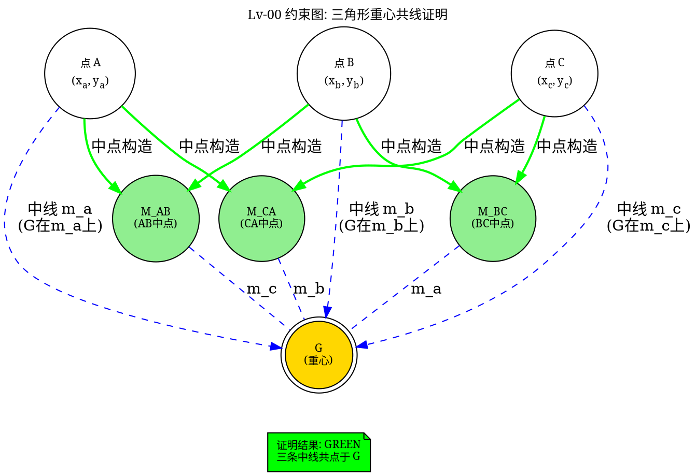

# Lv-00 参考落地设计文档：Graphviz DOT 声明式图描述语言

> **版本**: 1.0.0
> **日期**: 2026-05-24
> **参考**: Graphviz (graphviz.org) —— 声明式图描述语言 DOT，30+ 年稳定维护的图可视化引擎
> **目标**: 借鉴 Graphviz DOT 的声明式图描述语法、6 种布局引擎、HTML-like 节点标签和子图聚类，映射到 Lv-00 的 `constraint_graph.h` DOT 导出函数、Web GUI 约束可视化与证明文档自动生成

---

## 目录

1. [Graphviz DOT 项目概述与 Lv-00 借鉴动机](#1-graphviz-dot-项目概述与-lv-00-借鉴动机)
2. [核心借鉴要点一：DOT 声明式语法映射约束图边](#2-核心借鉴要点一dot-声明式语法映射约束图边)
3. [核心借鉴要点二：6 种布局引擎的几何语义](#3-核心借鉴要点二6-种布局引擎的几何语义)
4. [核心借鉴要点三：HTML-like 标签与子图聚类](#4-核心借鉴要点三html-like-标签与子图聚类)
5. [Lv-00 映射方案：constraint_graph.h DOT 导出](#5-lv-00-映射方案constraint_graphh-dot-导出)
6. [Web GUI 约束可视化的应用](#6-web-gui-约束可视化的应用)
7. [实现路线图](#7-实现路线图)
8. [关键映射表](#8-关键映射表)

---

## 1. Graphviz DOT 项目概述与 Lv-00 借鉴动机

### 1.1 Graphviz 是什么

Graphviz 是 AT&T 实验室于 1990 年代初期创建的图可视化工具集，其核心是一个**声明式图描述语言 DOT**和一个将 DOT 文本自动渲染为矢量图形的布局引擎。经过 30+ 年的持续维护，Graphviz 已成为几乎每一个技术领域都在使用的图可视化标准。

```
DOT 示例：一个简单的有向图
───────────────────────────────
digraph G {
    rankdir=LR;                    // 从左到右布局
    node [shape=box, style=filled, fillcolor=lightblue];

    A [label="起点"];               // 节点声明
    B [label="中点", color=red];
    C [label="终点"];

    A -> B [label="距离=5", color=blue];   // 有向边声明
    B -> C [label="距离=3", color=blue];
    A -> C [label="距离=8",
            style=dashed, color=gray];     // 带样式的边

    subgraph cluster_0 {            // 子图聚类
        label="子系统 1";
        A; B;
    }
}
```

### 1.2 Lv-00 借鉴动机

Lv-00 的约束图（`ConstraintGraph`）是一个有向无环图，节点为几何实体（点、线、圆、区域、函数块），边为约束关系。DOT 语言天然适合描述这类图结构，且 Graphviz 拥有成熟的 Python/JS/WASM 绑定，完美契合 Lv-00 的 Web 可视化需求：

| 借鉴方向 | Graphviz 特性 | Lv-00 现有基础 | 差距 |
|:---|:---|:---|:---|
| **声明式图描述** | `A -> B [label="..."]` | `constraint_graph.h` 的节点/边结构 | 需 `graph_export_dot()` 导出函数 |
| **6 种布局引擎** | dot/neato/fdp/sfdp/circo/twopi | 无 | Web 前端可选用不同引擎 |
| **HTML-like 标签** | 富文本节点显示 | Web 节点仅显示名称 | 可显示坐标/类型/TrustColor |
| **子图聚类** | `subgraph cluster_X` | `FuncBlock` 嵌套功能块 | 嵌套图导出为 DOT 子图 |
| **30+ 年生态系统** | Python/JS/WASM 绑定 | 计划中的 Web GUI | 可直接集成 viz.js (WASM) |

### 1.3 核心概念对照

```
Graphviz DOT                            Lv-00
─────────────────────────────────────────────────────────
digraph G { ... }                   →  ConstraintGraph (有向约束图)
node [shape=box]                    →  GeomEntity 节点 (类型→形状映射)
A [label="...", color=red]        →  节点属性: name, TrustColor, type
A -> B [label="distance=5"]       →  Constraint 边: 类型, 参数, TrustColor
subgraph cluster_X                 →  FuncBlock 内部子图 (嵌套约束图)
rankdir (TB/LR)                   →  布局方向 (从上到下/从左到右)
dot/neato/fdp/... layout         →  Web 前端可选的可视化布局引擎
viz.js (Emscripten WASM)          →  Web GUI 内嵌渲染
```

---

## 2. 核心借鉴要点一：DOT 声明式语法映射约束图边

### 2.1 DOT 语法的清晰性

DOT 的边声明语法 `A -> B [label="...", color=...]` 极其简洁，恰好可以直接映射 Lv-00 的约束边：

```
Lv-00 约束图                        DOT 等价
────────────────────────────────────────────────────────────
constraint C1:                        point_A -> point_B
  type = DISTANCE                       [label="距离 = 5",
  params = {value = 5}                   color=green,
  trust = GREEN                          penwidth=2];

constraint C2:                        point_A -> line_l
  type = INCIDENCE                      [label="在线上",
  trust = BLUE                           color=blue,
                                          style=dashed];

constraint C3:                        func_median -> point_M
  type = CONSTRUCTION                   [label="中点构造",
  trust = GREEN                           color=green,
  func_block = "midpoint"                 shape=box];
```

### 2.2 约束类型到 DOT 视觉属性的映射表

```c
/**
 * @brief Lv-00 约束类型 → DOT 边视觉属性映射表
 *
 * 每种 ConstraintType 在 DOT 导出时获得不同的视觉编码，
 * 使得用户可以在生成的可视化图中快速区分不同类型的约束。
 *
 * 设计原则:
 *   - 距离/夹角等度量约束 → 实线 + 参数标签
 *   - 共线/共点等拓扑约束 → 点线 + 简洁标签
 *   - 构造约束 → 粗线 + FuncBlock 名称
 *   - TrustColor GREEN/AMBER/RED → 边颜色
 */
typedef struct {
    ConstraintType type;            /* 约束类型 */
    char *dot_color;                /* DOT 边颜色 */
    char *dot_style;                /* DOT 边样式 (solid/dashed/dotted/bold) */
    char *label_prefix;             /* 标签前缀 (如 "距离=", "共线", "构造: ") */
} ConstraintDotStyle;

static const ConstraintDotStyle CONSTRAINT_DOT_STYLES[] = {
    { CONSTRAINT_DISTANCE,    "green",  "solid",  "距离="       },
    { CONSTRAINT_ANGLE,       "green",  "solid",  "角度="       },
    { CONSTRAINT_INCIDENCE,   "blue",   "dashed", "共线/共点: "   },
    { CONSTRAINT_PARALLEL,    "purple", "dashed", "平行"         },
    { CONSTRAINT_PERPENDICULAR,"red",   "dashed", "垂直"         },
    { CONSTRAINT_CONTAINMENT, "orange", "dotted", "包含"        },
    { CONSTRAINT_CONSTRUCTION,"black",  "bold",   "构造: "      },
    { CONSTRAINT_EQUALITY,    "gray",   "solid",  "相等"         },
    { CONSTRAINT_CUSTOM,      "brown",  "dotted", "自定义: "    },
};
```

### 2.3 几何实体节点到 DOT node 的映射

| Lv-00 GeomEntity | DOT shape | DOT fillcolor | 说明 |
|:---|:---|:---|:---|
| `GEOM_POINT` | `circle` | `lightgreen` | 点 = 圆形节点 |
| `GEOM_LINE` | `plaintext` (无边框，标签为线) | — | 线 = 边的中间标签 |
| `GEOM_CIRCLE` | `doublecircle` | `lightblue` | 圆 = 双圆节点 |
| `GEOM_TRIANGLE` | `triangle` | `lightyellow` | 三角形 = 三角节点 |
| `GEOM_POLYGON` | `polygon` | `lightyellow` | 任意多边形 |
| `GEOM_REGION` | `box3d` | `lightgray` | 区域 = 3D 盒 |
| `GEOM_FUNCBLOK` | `box, style=filled` | `lavender` | 函数块 = 填充矩形 |
| `GEOM_FREE_POINT` | `circle` | `white` | 自由点 = 白底圆 |
| `GEOM_CONSTRUCTED_POINT` | `circle` | `lightgreen` | 构造点 = 绿底圆 |

---

## 3. 核心借鉴要点二：6 种布局引擎的几何语义

### 3.1 Graphviz 的 6 种布局引擎

Graphviz 提供了 6 种不同类型的布局算法，每种适用于不同的图结构。Lv-00 的约束图可以根据可视化目的选择不同的布局引擎：

| 引擎 | 算法原理 | 适用场景 | Lv-00 约束图用途 |
|:---|:---|:---|:---|
| **dot** | 层级布局（Sugiyama 框架） | 有向无环图、依赖图 | **默认引擎**——展示几何构造的先后依赖关系 |
| **neato** | 弹簧模型（Kamada-Kawai） | 无向图、力导向 | 展示约束"紧密度"——紧密约束拉近，松弛约束拉远 |
| **fdp** | 力导向（Fruchterman-Reingold） | 大规模图 | 展示约束全局结构——"引力"= 约束强度 |
| **sfdp** | 多尺度力导向 | 超大规模图（>10000 节点） | 复杂证明的约束全图 |
| **circo** | 环形布局 | 循环图、环形结构 | 展示循环约束链（角度的周期关系） |
| **twopi** | 径向布局 | 星型图、中心辐射 | 展示以某点为中心的辐射约束（如点到所有边的距离） |

### 3.2 布局引擎选择的 Lv-00 语义

```c
/**
 * @brief Lv-00 DOT 导出布局引擎选择 —— 借鉴 Graphviz 的多布局引擎
 *
 * 每种布局引擎为相同的约束图提供不同的可视化视角。
 *
 * 推荐策略:
 *   - 构造步骤较少 (< 10 步骤) → dot (层级，展示"先构造什么后构造什么")
 *   - 约束密集 (大量等距/等角) → neato (力导向，展示约束网络)
 *   - 证明文档 (论文级输出) → dot (层级，清晰的因果链)
 *   - Web 交互式探索 → 允许用户切换所有 6 种引擎
 */
typedef enum {
    LV_DOT_ENGINE_DOT,      /* 层级布局——展示构造顺序 */
    LV_DOT_ENGINE_NEATO,    /* 弹簧模型——展示约束紧密度 */
    LV_DOT_ENGINE_FDP,      /* 力导向——展示全局约束结构 */
    LV_DOT_ENGINE_SFDP,     /* 多尺度——大规模约束图 */
    LV_DOT_ENGINE_CIRCO,    /* 环形——展示循环约束 */
    LV_DOT_ENGINE_TWOPI     /* 径向——展示中心辐射约束 */
} LvDotEngine;

/**
 * @brief DOT 导出配置
 */
typedef struct {
    LvDotEngine engine;             /* 选择的布局引擎 */
    bool show_trust_colors;         /* 是否用 TrustColor 着色 */
    bool show_coordinates;          /* 是否在节点标签中显示坐标值 */
    bool show_constraint_params;    /* 是否在边标签中显示约束参数 */
    bool use_html_labels;           /* 是否使用 HTML-like 富文本标签 */
    char *graph_title;              /* 图标题 */
    double dpi;                     /* 输出分辨率 */
    char *output_format;            /* "svg", "png", "pdf", "dot" (仅生成DOT源码) */
} DotExportConfig;
```

### 3.3 布局引擎对约束图的可视化效果

```
同一约束图在不同布局引擎下的视觉效果:

dot (层级):
    A ──→ B ──→ C                 清晰的构造顺序
    │              ↑               A→B→C 是主要的构造链
    └───→ D ──────┘               A→D→C 是辅助构造

neato (弹簧模型):
        B                          约束紧密的节点靠得近
       / \                         距离约束拉近 A 和 B
      A───C                        共线性约束对齐 B-C-D
       \ /
        D

circo (环形):
         A                         展示"围绕中心"的约束结构
        /|\                        如以某点为中心圆的若干射线
     D──O──B
        \|/
         C

twopi (径向):
            B                      以某点为"根"的辐射结构
           /|\                     如点到各边的垂足
      F───A───C
           |\
           D E
```

---

## 4. 核心借鉴要点三：HTML-like 标签与子图聚类

### 4.1 HTML-like 标签：富文本节点显示

Graphviz 支持在节点中使用 HTML-like 标签，允许在单个节点内显示结构化信息（表格、颜色、多行文本）。Lv-00 可以利用这一特性在节点中显示几何实体的详细元数据：

```
// DOT HTML-like 节点标签 —— Lv-00 几何节点富文本
A [label=<
  <TABLE BORDER="0" CELLBORDER="1" CELLSPACING="0">
    <TR><TD BGCOLOR="lightgreen"><B>点 A</B></TD></TR>
    <TR><TD>坐标: (3.00, 4.00)</TD></TR>
    <TR><TD>类型: RATIONAL</TD></TR>
    <TR><TD>范畴: EuclideanSpace</TD></TR>
    <TR><TD BGCOLOR="green"><FONT COLOR="white">Trust: GREEN</FONT></TD></TR>
  </TABLE>
>];

// DOT HTML-like 边标签 —— Lv-00 约束边富文本
A -> B [label=<
  <TABLE BORDER="0">
    <TR><TD BGCOLOR="green"><FONT COLOR="white">距离 = 5</FONT></TD></TR>
    <TR><TD>推导: 毕达哥拉斯定理</TD></TR>
    <TR><TD>来源: axiom_package(euclidean)</TD></TR>
  </TABLE>
>, color=green];
```

### 4.2 子图聚类：嵌套约束组

Graphviz 的 `subgraph cluster_X` 语法可以将一组节点和边组织为一个带边框和标题的逻辑分组。Lv-00 的 `FuncBlock` 嵌套恰好对应这一结构：

```
// Lv-00 FuncBlock 嵌套 → DOT 子图聚类
digraph constraint_graph {
    compound=true;

    subgraph cluster_func_euler_circle {
        label="FuncBlock: euler_circle";
        style=filled; fillcolor=lightyellow;
        labeljust="l"; fontsize=14;

        // 输入端口
        in_tri [shape=cds, label="in: Triangle", color=blue];

        subgraph cluster_func_circumcenter {
            label="子块: circumcenter";
            style=filled; fillcolor=lightblue;

            in_A [shape=point, label="A"];
            in_B [shape=point, label="B"];
            in_C [shape=point, label="C"];
            out_O [shape=circle, label="O (外心)", color=green];

            in_A -> out_O;
            in_B -> out_O;
            in_C -> out_O;
        }

        subgraph cluster_func_orthocenter {
            label="子块: orthocenter";
            style=filled; fillcolor=lightblue;

            in_A2 [shape=point, label="A"];
            in_B2 [shape=point, label="B"];
            in_C2 [shape=point, label="C"];
            out_H [shape=circle, label="H (垂心)", color=green];

            in_A2 -> out_H;
            in_B2 -> out_H;
            in_C2 -> out_H;
        }

        out_circle [shape=doublecircle, label="c (九点圆)", color=green];

        out_O -> out_circle [label="圆心"];
        out_H -> out_circle [label="N = midpoint(O,H)"];
    }
}
```

### 4.3 子图聚类的 Lv-00 导出函数

```c
/**
 * @brief 递归导出 FuncBlock 嵌套为 DOT 子图聚类
 *
 * 对于 ConstraintGraph 中的每个 FuncBlock 节点，
 * 如果其 internal_graph 非空，则递归导出为 subgraph cluster。
 *
 * Graphviz 等价:
 *   subgraph cluster_func_XXX { label="FuncBlock: XXX"; ... }
 *
 * Lv-00 映射:
 *   FuncBlock 节点 → subgraph cluster (带边框和标题)
 *   FuncBlock.input_ports → 子图内输入端口节点 (shape=cds)
 *   FuncBlock.output_ports → 子图内输出端口节点 (shape=cds)
 *   FuncBlock.internal_graph → 子图内的节点和边
 */
int dot_export_funcblock_nested(
    FILE *out,
    const FuncBlockNesting *nesting,
    int indent_level,
    const DotExportConfig *config);

/**
 * @brief 生成 HTML-like 标签的几何节点元数据
 *
 * 为每个几何实体节点生成一个 HTML-like TABLE 标签，
 * 包含: 名称、坐标、类型、范畴、TrustColor 等信息。
 *
 * 如果 DotExportConfig.use_html_labels == false，
 * 则退化为简单的文本标签 "A (3,4)"。
 */
char *dot_html_label_for_geom_node(
    const GeomEntity *node,
    const TypeSystem *ts,
    const DotExportConfig *config);

/**
 * @brief 生成 HTML-like 标签的约束边元数据
 */
char *dot_html_label_for_constraint(
    const Constraint *edge,
    const DotExportConfig *config);
```

---

## 5. Lv-00 映射方案：constraint_graph.h DOT 导出

### 5.1 导出入口：graph_export_dot()

```c
/**
 * @brief 将 Lv-00 约束图导出为 Graphviz DOT 格式 —— 主入口函数
 *
 * 这是 Lv-00 constraint_graph.h 中已规划的函数。
 * 完成从约束图 → DOT 文本的完整转换。
 *
 * 导出流程:
 *   1. 遍历所有节点 → 生成 DOT node 语句
 *   2. 遍历所有约束边 → 生成 DOT edge 语句
 *   3. 遍历所有 FuncBlock 嵌套 → 生成 DOT subgraph cluster
 *   4. 生成图属性 (布局引擎、标题、全局样式)
 *   5. 写入文件
 *
 * @param[in] graph   Lv-00 约束图
 * @param[in] filepath  输出 .dot 文件路径
 * @param[in] config 导出配置（可为 NULL，使用默认配置）
 * @return 0 成功，-1 失败
 */
int graph_export_dot(
    const ConstraintGraph *graph,
    const char *filepath,
    const DotExportConfig *config);
```

### 5.2 导出的 DOT 文件完整示例



---

## 6. Web GUI 约束可视化的应用

### 6.1 基于 viz.js 的浏览器内渲染

Graphviz 已通过 Emscripten 编译为 WebAssembly，称为 [viz.js](https://github.com/aduh95/viz.js)。Lv-00 的 Web GUI 可以直接集成 viz.js，在前端将 DOT 文本实时渲染为 SVG：

```
Web GUI 约束可视化架构:
─────────────────────────────────────────────────
Lv-00 C 内核 (WASM)
    │
    ├── graph_export_dot(graph, "/tmp/graph.dot")
    │       │ 生成 DOT 文本
    │       ▼
    │   DOT 字符串 (UTF-8)
    │
    ▼
Web 前端 (JavaScript)
    │
    ├── 接收 DOT 字符串
    ├── viz.renderSVG(dotString)
    │       │ 调用 viz.js WASM 引擎
    │       ▼
    │   渲染为 SVG DOM 节点
    │
    ├── 注入到画布容器
    │
    └── 添加交互层:
        ├── 鼠标悬停 → 高亮节点 + 显示详细信息
        ├── 点击节点 → 展开 FuncBlock 嵌套子图
        ├── 按键切换布局引擎 (1=dot, 2=neato, 3=fdp...)
        └── 缩放/平移 (SVG viewBox 变换)
```

### 6.2 SVG 交互增强

```javascript
/**
 * @brief Lv-00 Web GUI 约束图交互控制器
 *
 * 在 viz.js 生成的 SVG 之上添加交互层，
 * 使得约束图从静态图片变为可探索的交互式图。
 */
class ConstraintGraphViewer {
    constructor(container, dotString) {
        this.container = container;
        this.dotString = dotString;
        this.currentEngine = 'dot';  // 当前布局引擎
        this.expandedNodes = new Set();
    }

    async render() {
        const svg = await viz.renderSVG(this.dotString, {
            engine: this.currentEngine
        });
        this.container.innerHTML = svg;
        this._attachInteractions();
    }

    _attachInteractions() {
        // 鼠标悬停 → 高亮节点
        this.container.querySelectorAll('.node').forEach(nodeEl => {
            nodeEl.addEventListener('mouseenter', () => {
                const nodeId = nodeEl.getAttribute('id');
                this._highlightConnectedEdges(nodeId);
                this._showTooltip(nodeId);
            });
            nodeEl.addEventListener('mouseleave', () => {
                this._clearHighlight();
                this._hideTooltip();
            });

            // 双击 → 展开/收起 FuncBlock 嵌套
            nodeEl.addEventListener('dblclick', () => {
                const nodeId = nodeEl.getAttribute('id');
                this._toggleExpand(nodeId);
            });
        });

        // 键盘切换布局引擎
        document.addEventListener('keydown', (e) => {
            const engines = ['dot', 'neato', 'fdp', 'sfdp', 'circo', 'twopi'];
            const index = parseInt(e.key) - 1;
            if (index >= 0 && index < engines.length) {
                this.currentEngine = engines[index];
                this.render();
            }
        });
    }
}
```

---

## 7. 实现路线图

### 7.1 第一阶段：核心 DOT 导出（P3）

| 任务 | 文件 | 说明 |
|:---|:---|:---|
| `graph_export_dot()` 主函数 | `src/constraint_graph.c` | 遍历节点/边，生成 DOT 文本 |
| `CONSTRAINT_DOT_STYLES` 映射表 | `src/constraint_graph.c` | 约束类型 → DOT 视觉属性 |
| 节点类型 → DOT shape 映射 | `src/constraint_graph.c` | GeomEntity → DOT node shape/color |
| TrustColor → DOT color 映射 | `src/constraint_graph.c` | GREEN/AMBER/RED/BLUE → DOT 颜色 |
| 单元测试：小型三角形约束图导出 | `tests/test_constraint_dot.c` | 比对手工 DOT 文件 |

**预估规模**：约 200 行 C 代码

### 7.2 第二阶段：HTML-like 标签与子图嵌套（P3-P4）

| 任务 | 文件 | 说明 |
|:---|:---|:---|
| `dot_html_label_for_geom_node()` | `src/constraint_graph.c` | HTML-like 富文本节点标签 |
| `dot_html_label_for_constraint()` | `src/constraint_graph.c` | HTML-like 富文本边标签 |
| `dot_export_funcblock_nested()` | `src/constraint_graph.c` | 递归导出 FuncBlock 子图 |
| `DotExportConfig` 默认配置 | `src/constraint_graph.c` | 各种导出选项 |

**预估规模**：约 180 行 C 代码

### 7.3 第三阶段：Web 前端集成（P4）

| 任务 | 说明 |
|:---|:---|
| 集成 viz.js (WASM) 到 Web GUI | 浏览器内 DOT → SVG 渲染 |
| `ConstraintGraphViewer` 交互组件 | SVG 图层之上的鼠标/键盘交互 |
| 布局引擎切换面板 | 1-6 键切换布局，工具栏下拉菜单 |
| 嵌套展开/收起 | 双击 FuncBlock 节点展开子图 |
| 与 WebSocket 实时同步 | 约束图变更 → 自动重新导出 DOT → 重新渲染 |

---

## 8. 关键映射表

### 8.1 Graphviz DOT → Lv-00 概念映射

| Graphviz DOT | Lv-00 映射 | Lv-00 文件 |
|:---|:---|:---|
| `digraph G { ... }` | `ConstraintGraph` 的有向约束图 | `constraint_graph.h` |
| `node [shape=circle, color=red]` | `GeomEntity` 节点（形状由类型决定） | `constraint_graph.h` |
| `A -> B [label="X", color=Y]` | `Constraint` 约束边（标签=约束参数） | `constraint_graph.h` |
| `A -> B [color=green]` | TrustColor GREEN 的约束边 | `constraint_graph.h` + `symbolic_coord.h` |
| `A -> B [color=red]` | TrustColor RED 的约束边（验证失败） | `constraint_graph.h` + `symbolic_coord.h` |
| `subgraph cluster_X` | `FuncBlockNesting` 的嵌套子图 | `func_block.h` |
| `rankdir=TB` | dot 引擎层级布局（TB=构造顺序） | DOT 导出配置 |
| `compound=true` | 启用嵌套子图的边跨子图连接 | DOT 导出配置 |
| HTML-like label `<TABLE>...</TABLE>` | 几何节点的富文本元数据显示 | `dot_html_label_for_geom_node()` |
| 6 种布局引擎 | `LvDotEngine` 枚举 → 可视化视角切换 | Web GUI |
| viz.js (Emscripten WASM) | Web 前端集成（浏览器内 DOT→SVG） | `web/constraint_viewer.js` |
| Python graphviz 绑定 | 后端测试/文档生成的 DOT 渲染 | `tools/render_graph.py` |

### 8.2 DOT 颜色映射表

| Lv-00 TrustColor | DOT color | DOT style | 含义 |
|:---|:---|:---|:---|
| `TRUST_GREEN` (0) | `green` | `solid`, `penwidth=2` | 已验证正确 |
| `TRUST_AMBER` (1) | `orange` | `dashed` | 部分验证/需审查 |
| `TRUST_RED` (2) | `red` | `bold`, `penwidth=3` | 验证失败 |
| `TRUST_BLUE` (3) | `blue` | `dotted` | 未验证/临时 |
| `TRUST_GRAY` (4) | `gray` | `dotted` | 已委托/不追踪 |

### 8.3 GeomEntity 类型 → DOT node 属性映射

| GeomEntity 类型 | DOT shape | DOT fillcolor | DOT penwidth |
|:---|:---|:---|:---|
| `GEOM_POINT` | `circle` | `lightgreen` | 1 |
| `GEOM_LINE` | `plaintext` | — | — |
| `GEOM_CIRCLE` | `doublecircle` | `lightblue` | 1 |
| `GEOM_TRIANGLE` | `triangle` | `lightyellow` | 1 |
| `GEOM_POLYGON` | `polygon` | `lightyellow` | 1 |
| `GEOM_REGION` | `box3d` | `lightgray` | 1 |
| `GEOM_FUNCBLOK` | `box` | `lavender` | 2 |
| `GEOM_CONSTRAINT` | `diamond` | `lightpink` | 1 |
| `GEOM_FREE_POINT` | `circle` | `white` | 1 |
| `GEOM_CONSTRUCTED_POINT` | `circle` | `lightgreen` | 1 |

---

> **文档结束**
> 本文档详述了 Graphviz DOT 声明式图描述语言如何映射到 Lv-00 的 `constraint_graph.h` DOT 导出函数、Web GUI 约束可视化与证明文档自动生成。核心结论：(1) DOT `A -> B [label="距离=5", color=red]` 语法与 Lv-00 的约束边完美对应——每条约束边成为一条 DOT 边，TrustColor 映射为 DOT 颜色，约束参数成为边标签；(2) 6 种 Graphviz 布局引擎为同一约束图提供 6 种可视化视角——dot 展示构造顺序，neato 展示约束紧密度，circo 展示循环结构；(3) HTML-like 标签和子图聚类分别对应几何节点的富文本元数据显示和 FuncBlock 的嵌套约束子图。Graphviz 30+ 年的稳定生态和 viz.js WASM 绑定为 Lv-00 Web GUI 提供了开箱即用的浏览器内约束图渲染能力。
