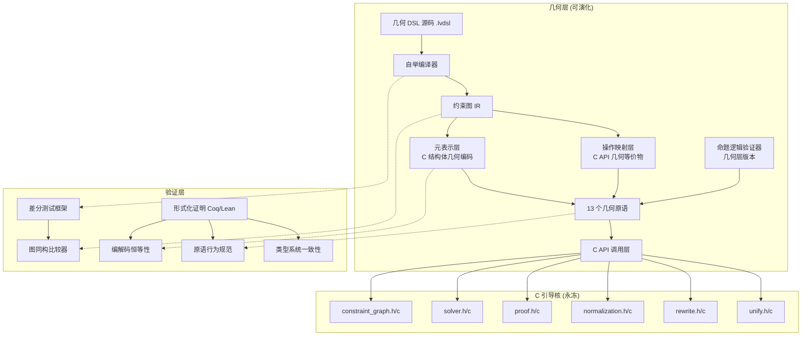

# Lv-00 自举架构设计文档

> **版本**: 1.0.0
> **日期**: 2026-05-24
> **状态**: 草案（设计阶段）
> **受众**: Lv-00 核心开发者、架构评审委员会
>
> **摘要**: 本文档完整描述了 Lv-00 项目的终极目标——**用 Lv-00 自身描述自身（自举）**——的架构设计。文档覆盖自举定义、技术路线、核心挑战、实现路线图、关键设计决策和借鉴分析，总计约 2000 行的详细设计规格。

---

## 目录

1. [自举的定义与目标](#1-自举的定义与目标)
2. [自举的技术路线](#2-自举的技术路线)
3. [核心挑战与解决方案](#3-核心挑战与解决方案)
4. [逐步实现路线图](#4-逐步实现路线图)
5. [关键设计决策](#5-关键设计决策)
6. [参考与借鉴](#6-参考与借鉴)
7. [附录：术语表与缩写](#附录术语表与缩写)

---

## 1. 自举的定义与目标

### 1.1 自举的精确含义

在 Lv-00 的语境中，"自举"（Self-bootstrapping）具有精确定义的语义边界，不可与通用编程语言的自举概念混淆。

**定义（Lv-00 自举）**：Lv-00 的几何层能够通过几何构造完整地定义 C 引导核的所有对外 API 接口，使得：

1. **几何层可表达 C 核的所有数据结构**：`GeomNode`、`Constraint`、`ConstraintGraph`、`SymbolicCoord`、`LV00Engine` 等 C 结构体在几何层有对应的几何编码。
2. **几何层可调用（或等效模拟）C 核的所有操作**：`graph_create`、`graph_add_point`、`solver_solve`、`unify_check` 等 C API 在几何层有对应的函数块或约束图操作。
3. **几何层可通过编译/解释链路将自身的几何定义转化为 C 核调用**：这个过程构成一个封闭的计算环路，使得 Lv-00 在抽象上可以"理解自身"。

**不包括的内容（重要边界澄清）**：
- 不要求用几何层**替代** C 核。C 核保持为不可替代的信任计算基（TCB）。
- 不要求 C 核的**实现在几何层内完成**。只要求 C 核的**接口**可在几何层被描述和操作。
- 不要求几何层运行时的**性能**与 C 核相当。自举验证的是语义等价，不是性能等价。

### 1.2 成功标准

自举成功的验收标准分为三个层级：

#### 核心成功标准（宣布自举成功的最低标准）

| 编号 | 标准 | 验证方式 |
|:---|:---|:---|
| SB-1 | **元表示完备性**：C 核中 5 种节点类型和 5 种约束类型的语义在几何层有完整编码，且可通过几何构造被例化 | 人工审查 + 自动化测试：遍历所有 10 种类型，确认几何编码可构造 |
| SB-2 | **API 映射完备性**：C 核的全部 API（约 80-100 个公开函数，见 `lv00.h` 及其包含的头文件）在几何层有对应的函数块或操作序列 | 脚本自动扫描 C 头文件，抽取所有公开函数签名，逐一确认几何层映射存在 |
| SB-3 | **编译器闭环**：自举编译器将几何层编写的 Lv-00 元描述编译为 C 核调用，产生的约束图与直接用 C API 构造的约束图图同构 | 差分测试：随机生成 100 个几何构造，分别通过几何层编译器路径和 C API 路径构造，比较图同构 |
| SB-4 | **命题逻辑验证器通过烟测**：命题逻辑验证器（已在 C 核中定义）的几何层版本通过精选烟测集（约 50 个直觉主义命题逻辑定理与谬误） | 正向烟测：应通过并产生合一证物；负向烟测：应报告"未能证明" |
| SB-5 | **自参考一致性**：自举编译器使用自身编译自身，产生的编译器与上一版本行为等价 | 随机属性测试：生成 500 个随机公式，两个版本应产生相同结果 |

#### 增强成功标准（自举后持续提升）

| 编号 | 标准 | 验证方式 |
|:---|:---|:---|
| SB-A | **性能不劣化**：自举编译器路径执行的核心操作（节点添加、约束求解、合一检查）的平均耗时不劣于直接 C API 路径的 10 倍 | 基准测试套件（100+ 操作序列） |
| SB-B | **完备性逼近**：随机命题逻辑公式的证明通过率 > 95%（排除真正不可证的公式） | 自动测试生成器 + Glivenko 翻译 |
| SB-C | **类型系统自证**：几何层的类型检查和宇宙层级检查结果与 C 层完全一致 | 类型一致性差分测试（200+ 类型表达式） |

### 1.3 与"沙盒不可穿透"原则的协调

Lv-00 的核心架构原则之一是**"沙盒不可穿透"**——C 引导核在自举成功后进入永久冻结状态（`lv00.h` 第 17.7 节）：

```
自举成功后，C 内核进入永久冻结状态：
- 内核代码文件在文件系统上设为只读
- 内核只暴露只读服务接口
- 几何层可在抽象阶梯上无限演化，但所有操作必须通过冻结的 C API 执行
- 冻结后内核可执行文件的哈希值公开发布
```

这一原则与自举的关系是一个**精心设计的悖论**：

```
         ┌────────────────────────────┐
         │  几何层（可演化、可修改）    │
         │  - 自举编译器               │
         │  - 命题逻辑验证器           │
         │  - 元描述（自身结构定义）    │
         └────────────┬───────────────┘
                      │ 编译/解释
                      ▼
         ┌────────────────────────────┐
         │  C 引导核（冻结、只读）     │
         │  - constraint_graph.h/c    │
         │  - solver.h/c              │
         │  - proof.h/c               │
         │  - 所有 C API 接口          │
         └────────────────────────────┘
```

**自举不要求修改 C 核**。自举的意义在于：
- C 核只需要提供"足够丰富的原语"，使得几何层可以在此基础上描述一切。
- 几何层的自举定义是**对 C 核接口的一个"模拟器"或"编译器"**——它将几何构造翻译为 C API 调用。
- 自举成功后，C 核的接口是**永冻**的，任何新的抽象（如新的约束类型、新的证明策略）都在几何层实现。

**类比**：就像 Lisp 的 `eval/apply` 可以用 Lisp 自身写出，但 `eval/apply` 最终依赖一个 C/汇编实现的原语集。Lv-00 的自举就是要用几何构造写出一个"几何层的 eval/apply"，但其底层依赖冻结的 C 核原语。

---

## 2. 自举的技术路线

自举分为四个阶段，每个阶段解决一个核心技术问题。

### 2.1 阶段一：元表示层 —— C 结构体的几何层编码

阶段一的目标是在几何层精确编码 C 核的核心数据结构。每一个 C 结构体需要一个几何隐喻（geometric metaphor）。

#### 2.1.1 整体映射策略

```
C 数据类型   →   几何隐喻
─────────────────────────────────────────────
struct/enum    →  REGION（区域）：结构体的"类型形状"
字段            →  POINT（点）或 PORT（端口）：结构体的"槽位"
指针            →  CONNECTION（连接）：指向另一个结构体区域的端口连线
union           →  选择器块（CONDITIONAL）：根据 tag 选择活跃分支
数组            →  有序 POINT 序列 + BETWEENNESS 约束
函数指针        →  FUNCTION_BLOCK（函数块）：封装了调用语义的块
整数/枚举值     →  QUADRATIC 坐标（a: 枚举值, b: 0, n: 0）
字符串          →  特殊 CONSTANT 区域 + 序列化后的符号坐标链
```

#### 2.1.2 核心结构体的几何编码

**GeomNode 的几何编码**

C 定义 (`constraint_graph.h:82-116`)：

```c
struct GeomNode {
    int id;                          // 全局唯一 ID
    GeomType type;                   // 节点类型枚举
    SymbolicCoord **symbolic_coords; // 符号坐标数组
    int coord_count;                 // 坐标数量
    TrustColor trust;                // 信任颜色
    LightOrangeSubtype lo_subtype;   // 浅橙子类型
    char *numeric_assumption_declaration; // 数值假设声明
    double numeric_precision;        // 数值精度
    int namespace_depth;             // 命名空间深度
    int parent_block_id;             // 父函数块 ID
    union { ... } data;              // 类型相关数据
};
```

**几何编码方案**：

```
┌─────────────────────────────────────────────────────────────┐
│                 GeomNode 元区域 (Meta-Region)                │
│                                                             │
│  ┌──────────┐   ┌──────────┐   ┌──────────┐               │
│  │  id 槽   │   │ type 槽  │   │ coord   │   ...          │
│  │  (PORT)  │   │  (PORT)  │   │ 槽(PORT)│               │
│  └────┬─────┘   └────┬─────┘   └────┬─────┘               │
│       │              │              │                       │
│  ┌────▼─────┐   ┌────▼─────┐   ┌────▼─────┐               │
│  │  int 值  │   │GeomType  │   │Symbolic  │               │
│  │ 区域     │   │值区域    │   │Coord     │               │
│  │          │   │          │   │数组区域  │               │
│  └──────────┘   └──────────┘   └──────────┘               │
│                                                             │
│  ┌──────────┐   ┌──────────┐   ┌──────────┐               │
│  │ trust    │   │ namespace│   │ parent   │               │
│  │ 槽(PORT) │   │ _depth   │   │ _block   │               │
│  │          │   │ 槽(PORT) │   │ 槽(PORT) │               │
│  └──────────┘   └──────────┘   └──────────┘               │
│                                                             │
│  ┌──────────────────────────────────────────┐              │
│  │  data 选择器块 (CONDITIONAL)              │              │
│  │  ├─ [GEOM_POINT]      → (空)             │              │
│  │  ├─ [GEOM_PORT]       → Port 子区域      │              │
│  │  ├─ [GEOM_REGION]     → Region 子区域    │              │
│  │  └─ [GEOM_FUNC_BLOCK] → FuncBlock 子区域 │              │
│  └──────────────────────────────────────────┘              │
└─────────────────────────────────────────────────────────────┘
```

**关键编码原语**：

| C 概念 | 几何编码 | 说明 |
|:---|:---|:---|
| `int` 类型字段 | 一个 `REGION` 区域，内含表示整数的有理数坐标点 | 使用 `a/1` 形式的有理数 |
| `enum` 类型字段 | 一个 `REGION` 区域 + 一个特殊的 `TYPE_TAG` 点 | 枚举值映射到有理数（0,1,2,...） |
| `int* / GeomNode**` 指针 | `CONNECTION` 约束，从当前区域的对应端口连接到目标区域的"入口端口" | 用连接表示指针 |
| `char*` 字符串 | `REGION` 区域，内含一个有序的 POINT 序列，每个点的坐标编码一个字符 | 使用 ASCII 码作为有理数坐标 |
| 动态数组 `int*` | 一个 `REGION` 区域 + 有序的端口序列 + `BETWEENNESS` 约束 | 数组长度存储在区域的一个槽位中 |
| `union` | 选择器块（`CONDITIONAL` 约束），根据 tag 字段值激活对应分支 | 使用选择器块表示联合体 |
| `struct` 嵌套 | 嵌入的 `REGION` 子区域 | 通过 `CONTAINMENT` 表示包含关系 |

#### 2.1.3 类型信息的编码

**GeomType 枚举编码**：

```
GeomType 的几何编码：

   值         几何区域名称
  ────────   ──────────────
  GEOM_POINT        →  类型区域: "POINT_TYPE"
  GEOM_LINE_SEGMENT →  类型区域: "LINE_SEGMENT_TYPE"
  GEOM_REGION       →  类型区域: "REGION_TYPE"
  GEOM_PORT         →  类型区域: "PORT_TYPE"
  GEOM_FUNCTION_BLOCK → 类型区域: "FUNC_BLOCK_TYPE"
```

每个类型区域包含：
- 一个 `TYPE_KIND` 标记点（编码枚举值 0-4）
- 与对应 C 类型的"字段签名"区域（描述该类型应有哪些字段）

**宇宙层级编码**：

Lv-00 的类型系统使用累积宇宙层级（第 0 层：基本几何体；第 1 层：类型区域；第 2 层：类型区域的类型...）。在几何编码中：

```
第 0 层对象：位于第 0 层命名空间
第 1 层区域：位于第 1 层命名空间，内部 POINT 标记为 TYPE_REGION
第 2 层区域：位于第 2 层命名空间，描述"类型区域的类型"
```

**宇宙层级在几何上的体现**：
- 第 n 层的区域可以**包含**（`CONTAINMENT`）第 n-1 层的区域
- `namespace_depth` 直接编码宇宙层级
- 类型检查使用 `type_universe_check()`（基础类 API）

**多态类型的编码**：

多态端口（`is_polymorphic = true`）在几何编码中使用"虚线框"区域：

```
┌────────────────────────────────┐
│  多态类型区域 (虚线边框)        │
│                                │
│  类型参数: α                   │  ← 一个未绑定的类型变量 POINT
│  约束: α ∈ Set_k               │  ← CONTAINMENT 约束
│                                │
│  [实例化后]                     │
│  α → Triangle                  │  ← CONNECTION 到具体类型区域
└────────────────────────────────┘
```

#### 2.1.4 语义验证：元表示的正确性条件

元表示需要满足以下语义条件才能被认为是"正确的"：

1. **结构保真性**：C 结构体的每个字段在几何编码中有唯一对应的槽位（PORT），且类型信息一致。
2. **构造保真性**：从几何编码可以无歧义地"反序列化"回对应的 C 结构体实例。这通过一个 `meta_decode` 函数块实现。
3. **关系保真性**：如果两个 C 结构体实例之间存在指针引用关系（如 `Constraint` 的 `participants` 指向 `GeomNode` 数组），则对应的几何编码之间也存在对应的 `CONNECTION` 约束。
4. **代数等价性**：C 层的整数、枚举值、字符串在几何层编码后，通过解码函数块可精确恢复原值。

### 2.2 阶段二：操作层 —— C API 的几何层映射

阶段二的目标是为每一个 C 核 API 函数定义一个几何层的等价操作。

#### 2.2.1 API 分类与映射策略

C API 可分为以下几类，每类有不同的几何映射策略：

| API 类别 | 示例函数 | 几何映射策略 |
|:---|:---|:---|
| **构造类** | `graph_create`, `graph_add_point`, `graph_add_constraint` | 直接映射为几何层原语（Function Block） |
| **查询类** | `graph_get_node`, `graph_get_last_added_node_id` | 映射为探针端口（Probe Port） |
| **计算类** | `solver_solve`, `normalization_run`, `rewrite_apply` | 映射为函数块（输入几何状态，输出几何状态） |
| **验证类** | `unify_check`, `proof_minimal_verify` | 映射为合一检查端口（返回是/否的端口） |
| **管理类** | `engine_create`, `engine_destroy`, `engine_load_module` | 映射为生命周期函数块 |
| **事件类** | `stream_emit`, `stream_subscribe` | 映射为事件流端口（连接即订阅） |

#### 2.2.2 构造类 API 的几何映射

**示例：`graph_add_point` 的几何映射**

C API 签名：
```c
int graph_add_point(ConstraintGraph *graph, SymbolicCoord **coords, int coord_count);
```

几何层等价物（Lv-00 DSL 伪代码）：
```
func_block AddPoint {
    input ports:
        graph: ConstraintGraph      // 目标约束图（元表示）
        coords: SymbolicCoord[]     // 符号坐标数组
        coord_count: int            // 坐标数量

    output ports:
        new_graph: ConstraintGraph  // 添加了点的新图
        new_node_id: int            // 新节点的 ID

    internal:
        // 1. 在元表示的约束图中创建一个 GEOM_POINT 节点
        node = meta_create_node(graph, "GEOM_POINT")

        // 2. 将坐标数组连接到新节点的 coord 槽位
        for i in 0..coord_count:
            meta_set_field(node, "coord_" + i, coords[i])

        // 3. 设置 namespace 信息
        meta_set_field_int(node, "namespace_depth", graph.current_depth)
        meta_set_field_int(node, "parent_block_id", -1)

        // 4. 将新节点添加到约束图的节点列表
        meta_append_to_array(graph.nodes, node)

        // 5. 返回修改后的图和节点 ID
        return (graph, node.id)
}
```

#### 2.2.3 计算类 API 的几何映射

**示例：`solver_solve` 的几何映射**

C API 签名：
```c
int solver_solve(ConstraintGraph *graph, int *dirty_vars, int dirty_count);
```

几何层等价物（Lv-00 DSL 伪代码）：
```
func_block SolverSolve {
    input ports:
        graph: ConstraintGraph      // 待求解的约束图
        dirty_vars: int[]           // 脏变量列表
        dirty_count: int

    output ports:
        solved_graph: ConstraintGraph  // 求解后的图（坐标已更新）
        dof_count: int                 // 剩余自由度
        status: SolverStatus           // 求解状态（OK/CONFLICT/MULTIPLE/...）

    internal:
        // === 第一步：提取代数方程 ===
        equations = []  // 几何编码的方程列表

        for each constraint c in graph.constraints:
            if c.type == INCIDENCE:
                eq = extract_incidence_equation(c, graph)
                equations.append(eq)
            elif c.type == DISTANCE:
                eq = extract_distance_equation(c, graph)
                equations.append(eq)
            // ... 其他约束类型

        // === 第二步：变量排序 ===
        ordered_vars = topological_sort(equations, dirty_vars)

        // === 第三步：求解 ===
        solved_vars = {}  // 变量 → 符号坐标 的映射

        for each var in ordered_vars:
            subsys = filter_dependent(equations, var)
            if is_linear(subsys):
                result = solve_linear_exact(subsys, var)
            elif is_quadratic(subsys):
                result = solve_quadratic_exact(subsys, var)
            else:
                result = solve_groebner(subsys, var)  // 使用 Groebner 基

            if result.is_conflict:
                return (graph, 0, CONFLICT)
            elif result.is_multiple:
                return (graph, 1, MULTIPLE)  // 需要选择器
            else:
                solved_vars[var] = result.solution

        // === 第四步：回代解到约束图 ===
        for each (var, solution) in solved_vars:
            meta_set_field(graph.get_node(var), "coord_0", solution)

        // === 第五步：计算剩余自由度 ===
        dof = count_unconstrained_nodes(graph)

        return (graph, dof, OK)
}
```

#### 2.2.4 位熔断与 A/B 计划切换的几何表示

位熔断和 A/B 计划切换是 Lv-00 的独特机制，需要在几何层有表示。

**位熔断的几何表示**：

```
func_block CircuitCheck {
    input ports:
        value: SymbolicCoord    // 要检查的坐标值
        threshold: int          // 位数阈值（默认 10^6）

    output ports:
        status: TripStatus      // OK / TRIPPED
        overflow_value: SymbolicCoord  // 触发熔断的值

    internal:
        // 计算值的位数
        bits = count_bits(value)

        // 比较
        if bits > threshold:
            // 触发熔断 → 设置熔断标记点
            trip_flag = create_point("TRIPPED")
            return (TRIPPED, value)
        else:
            return (OK, NULL)
}

// 熔断处理函数块
func_block HandleTrip {
    input ports:
        trip_status: TripStatus
        current_graph: ConstraintGraph
        user_choice: UserChoice   // IGNORE / ROLLBACK / DEGRADE

    output ports:
        result_graph: ConstraintGraph

    internal:
        if user_choice == IGNORE:
            // 接受当前状态，标记节点为 AMBER
            mark_node_amber(current_graph, trip_status.node_id)
            return current_graph

        elif user_choice == ROLLBACK:
            // 恢复到冻结点快照
            return load_snapshot(current_graph.frozen_point)

        elif user_choice == DEGRADE:
            // 永久降级为数值假设
            if trip_count >= 3:
                degrade_to_numeric(current_graph, trip_status.node_id)
                return current_graph
}
```

**A/B 计划切换的几何表示**：

```
func_block PlanSwitch {
    input ports:
        engine: LV00Engine

    output ports:
        active_plan: PlanType   // PLAN_A / PLAN_B

    internal:
        // 压力测试函数块
        test_result = AlgebraicStressTest(engine)

        if test_result.precision_stable AND test_result.perf_stable:
            return PLAN_A
        else:
            // 切换到 B 计划
            switch_to_plan_b(engine)
            return PLAN_B
}
```

#### 2.2.5 API 映射完备性矩阵

以下是将要映射的全部 C API 的分类矩阵：

```
分类           API 数量    几何映射工作量    优先级
─────────────────────────────────────────────────
构造类           ~35        低（直接映射）    P0
查询类           ~15        低（探针端口）    P0
计算类           ~20        高（算法实现）    P1
验证类           ~10        中（合一模式）    P1
管理类           ~10        低（生命周期块）  P2
事件类           ~5         低（流端口）      P2
合计             ~95        —                —
```

### 2.3 阶段三：编译器层 —— 几何 DSL 到 C API 的编译通路

阶段三是自举的关键——需要一条编译通路将几何层的构造转化为对 C 核的实际调用。

#### 2.3.1 编译目标选择

有三种编译目标可供选择：

```
方案 A：直接 C 调用编译
  几何 DSL → [解析] → [语义分析] → C 代码生成 → GCC/Clang → 可执行文件
  优点：性能最好，与现有 C 核无缝集成
  缺点：编译链路长，调试困难

方案 B：中间表示（IR）+ 解释执行
  几何 DSL → [解析] → IR（约束图 JSON） → [解释器] → C API 调用
  优点：灵活，可交互式执行，利于调试
  缺点：性能损失约 2-5x

方案 C：混合方案（推荐）
  几何 DSL → [解析] → IR（约束图） → [JIT 编译] → 热路径 C 调用
                                    → [解释执行] → 冷路径
  优点：性能与灵活性的平衡
  缺点：实现复杂度最高
```

**推荐方案 C（混合方案）**，理由：
- Lv-00 的几何 DSL 操作大部分是"构造性的"（添加节点/约束），适合解释执行。
- 计算密集型操作（求解器、重写引擎）需要编译后执行以保证性能。
- JIT 编译可以延迟到"首次使用"时触发，降低冷启动开销。

#### 2.3.2 最小原语集

自举编译器需要一个"最小原语集"——这是几何层编译器可以直接映射到 C API 的原子操作。所有更复杂的操作通过组合这些原语实现。

**几何编译器原语（Geo-Primitive）**：

```
原语                         C API 对应              说明
────────────────────────────────────────────────────────────────────
geo-create-node              graph_add_point/        创建任意类型的节点
                             line_segment/etc.
geo-create-constraint        graph_add_constraint     创建任意类型的约束
geo-get-node                 graph_get_node          按 ID 获取节点
geo-get-constraint           graph_get_constraint    按 ID 获取约束
geo-set-coord                graph_update_coord      更新节点的符号坐标
geo-set-field                graph_set_node_field    设置节点的元数据字段
geo-delete-node              graph_delete_node       删除节点（含级联）
geo-pack-function            func_block_pack         打包函数块
geo-instantiate              func_block_instantiate  实例化函数块
geo-unify                    unify_check             合一检查
geo-solve                    solver_solve            求解约束图
geo-normalize                normalization_run       规范化约束图
geo-rewrite                  rewrite_apply           应用重写规则
────────────────────────────────────────────────────────────────────
合计：13 个原语
```

这 13 个原语是**编译器可以直接映射到 C API 的**，无需在几何层再实现。它们是 C 核提供给几何层的"汇编指令集"。

#### 2.3.3 编译器架构

```
┌──────────────────────────────────────────────────────────────┐
│                    自举编译器架构                              │
│                                                               │
│  ┌─────────────────┐                                         │
│  │ 几何 DSL 源码    │  (.lvdsl 文件)                          │
│  │ - func_block 定义│                                         │
│  │ - 变量/端口声明  │                                         │
│  │ - 约束表达式     │                                         │
│  └────────┬────────┘                                         │
│           │                                                   │
│  ┌────────▼────────┐                                         │
│  │ 词法分析器       │  (Lexer)                                │
│  │ - 关键词识别     │  标记流                                  │
│  │ - 符号坐标解析   │                                         │
│  └────────┬────────┘                                         │
│           │                                                   │
│  ┌────────▼────────┐                                         │
│  │ 语法分析器       │  (Parser)                               │
│  │ - func_block 语法│  抽象语法树 (AST)                        │
│  │ - 约束语法       │                                         │
│  └────────┬────────┘                                         │
│           │                                                   │
│  ┌────────▼────────┐                                         │
│  │ 语义分析器       │  (Semantic Analyzer)                    │
│  │ - 类型检查       │  标注 AST                                │
│  │ - 作用域解析     │                                         │
│  │ - 宇宙层级检查   │                                         │
│  └────────┬────────┘                                         │
│           │                                                   │
│  ┌────────▼────────┐                                         │
│  │ IR 生成器        │  (IR Generator)                         │
│  │ - AST → 约束图   │  中间表示（JSON 约束图）                 │
│  └────────┬────────┘                                         │
│           │                                                   │
│     ┌─────┴─────┐                                             │
│     │           │                                             │
│  ┌──▼──┐   ┌───▼───┐                                         │
│  │JIT   │   │解释器 │                                         │
│  │编译  │   │       │                                         │
│  │C代码 │   │IR执行 │                                         │
│  └──┬──┘   └───┬───┘                                         │
│     │           │                                             │
│     └─────┬─────┘                                             │
│           │                                                   │
│  ┌────────▼────────┐                                         │
│  │ C API 调用层     │  (FFI / C Linkage)                      │
│  │ - graph_add_*    │                                         │
│  │ - solver_solve   │                                         │
│  │ - unify_check    │                                         │
│  └────────┬────────┘                                         │
│           │                                                   │
│  ┌────────▼────────┐                                         │
│  │ C 引导核         │  (lv00.h API)                           │
│  └─────────────────┘                                         │
└──────────────────────────────────────────────────────────────┘
```

#### 2.3.4 几何 DSL 语法草案

Lv-00 的几何 DSL 需要在现有的函数块构造语法基础上扩展，以支持元编程。

```
// === 函数块定义 ===
func_block solver_solve(graph: ConstraintGraph, dirty: int[], count: int)
    -> (solved: ConstraintGraph, dof: int, status: SolverStatus)
{
    // 局部变量（作为几何 POINT 节点）
    let equations = [];           // 动态数组
    let solved_vars = {};         // 映射表

    // === for-each 遍历约束图 ===
    for each c in graph.constraints {
        match c.type {
            INCIDENCE => {
                let eq = extract_incidence(c, graph);
                equations.push(eq);
            }
            DISTANCE => {
                let eq = extract_distance(c, graph);
                equations.push(eq);
            }
            _ => {}  // 跳过其他约束
        }
    }

    // === 拓扑排序 ===
    let ordered = topological_sort(equations, dirty);

    // === 逐变量求解 ===
    for each var in ordered {
        let subsys = filter(equations, var);
        let result = solve_subsystem(subsys, var);

        if result == CONFLICT {
            return (graph, 0, CONFLICT);
        } else if result == MULTIPLE {
            return (graph, 1, MULTIPLE);
        } else {
            solved_vars[var] = result.solution;
        }
    }

    // === 回代与自由度计算 ===
    back_substitute(graph, solved_vars);
    let dof = count_free_nodes(graph);
    return (graph, dof, OK);
}
```

**DSL 关键词表**：

```
func_block    →  定义函数块
let           →  局部变量绑定（去糖为 λ 应用）
for each      →  遍历集合（几何层：遍历约束图节点的端口）
match         →  模式匹配（几何层：选择器块）
if/else/elif  →  条件分支（几何层：选择器块）
return        →  输出端口赋值
push          →  数组添加元素（几何层：添加新端点 + BETWEENNESS）
{}            →  代码块（几何层：函数块内部子图）
```

#### 2.3.5 编译器自身的实现语言

这是一个关键决策点（详见第 5.3 节）。推荐方案：

**编译器第一版用 Python 实现**，原因：
- Python 有成熟的词法/语法分析库（`ply`, `lark`）
- 与现有 Python DSL 和 Jupyter 集成无缝衔接
- 快速原型开发，可以在 2-3 周内完成可工作的编译器
- Python 版本通过测试后，可以用几何 DSL 重写为自举版本

**编译器第二版用几何 DSL 重写**（即自举编译器编译自身）：
- 用第一版编译器编译第二版源码
- 第二版编译器应产生与第一版相同的输出
- 这是自举的终极验证

### 2.4 阶段四：验证层 —— 自举正确性的证明

阶段四解决的根本问题：**我们如何知道自举是正确的？**

#### 2.4.1 需要证明的性质

自举需要证明以下性质的集合：

```
┌────────────────────────────────────────────────────────────────────┐
│                        自举正确性证明层次                           │
│                                                                    │
│  Level 3: 行为等价性证明                                           │
│  ┌──────────────────────────────────────────────────────────┐     │
│  │ 自举编译器编译的代码产生的约束图                            │     │
│  │     ≡                                                      │     │
│  │ 直接使用 C API 构造的约束图                                 │     │
│  │ (在图同构意义下)                                            │     │
│  └──────────────────────────────────────────────────────────┘     │
│           ↑ 需要                                                │
│  Level 2: 编译器保语义性证明                                      │
│  ┌──────────────────────────────────────────────────────────┐     │
│  │ DSL 源码经编译器处理后，其操作语义不变                      │     │
│  │ (源语言的指称语义 = 目标 C API 调用的组合语义)              │     │
│  └──────────────────────────────────────────────────────────┘     │
│           ↑ 需要                                                │
│  Level 1: 元表示正确性证明                                        │
│  ┌──────────────────────────────────────────────────────────┐     │
│  │ C 结构体的几何编码 → meta_decode → 原始 C 结构体           │     │
│  │ (编解码为恒等变换)                                          │     │
│  └──────────────────────────────────────────────────────────┘     │
│           ↑ 需要                                                │
│  Level 0: 基础正确性条件                                          │
│  ┌──────────────────────────────────────────────────────────┐     │
│  │ - 13 个原语与 C API 的对应关系正确                         │     │
│  │ - C 核的规范行为文档化                                      │     │
│  │ - 编译器不引入额外副作用                                    │     │
│  └──────────────────────────────────────────────────────────┘     │
└────────────────────────────────────────────────────────────────────┘
```

#### 2.4.2 形式化可验证 vs 测试可验证

| 性质 | 形式化验证 | 测试验证 | 说明 |
|:---|:---|:---|:---|
| 元表示编解码恒等 | **是** | 补充 | 可以通过 Coq/Lean 形式化 `meta_encode ∘ meta_decode = id` |
| 编译器保语义性 | **部分** | **主要** | 核心约简规则可形式化；完整语义需测试覆盖 |
| API 映射完备性 | 否 | **是** | 通过脚本自动扫描和验证 |
| 行为等价性 | 否 | **是** | 基于随机属性测试（property-based testing） |
| 求解器输出等价 | **部分** | **主要** | Gröbner 基算法正确性可形式化；多解分支选择需测试 |
| 类型系统一致性 | **是** | 补充 | 类型检查是纯函数，可完全形式化 |

#### 2.4.3 自举与不自举版本的行为等价性证明策略

采用 **差分测试（Differential Testing）** 作为主要验证手段：

```
验证流程:

1. 随机生成测试用例:
   - 随机几何构造序列（添加节点/约束的组合）
   - 随机命题逻辑公式（用于验证命题逻辑验证器）
   - 随机类型表达式（用于类型系统一致性）

2. 并行执行:
   ┌─────────────────┐     ┌─────────────────┐
   │ 自举编译器路径   │     │ 直接 C API 路径  │
   │                  │     │                  │
   │ DSL源码 → 编译器 │     │ C 代码直接调用   │
   │ → 约束图 IR     │     │ C API           │
   │ → C API 调用    │     │ → 约束图结果     │
   │ → 约束图结果    │     │                  │
   └────────┬────────┘     └────────┬────────┘
            │                       │
            └───────────┬───────────┘
                        │
              ┌─────────▼─────────┐
              │  图同构比较        │
              │  (VF2 算法 +      │
              │   WL 图核哈希)    │
              │                   │
              │  等价 / 不等价    │
              └───────────────────┘
```

**随机属性测试框架**：

```python
# 伪代码：差分测试框架
def differential_test(n_cases=500):
    """随机属性测试：自举编译器 vs C API 直接调用"""

    for i in range(n_cases):
        # 生成随机测试用例
        test = RandomTestCaseGenerator().generate(
            max_nodes=20,
            max_constraints=30,
            constraint_types=ALL_TYPES
        )

        # 路径 A：自举编译器
        dsl_source = test.to_dsl_source()
        ir_graph = bootstrap_compiler.compile(dsl_source)
        result_a = ir_graph.execute()

        # 路径 B：直接 C API
        c_code = test.to_c_code()
        result_b = compile_and_run(c_code)

        # 比较
        if not graph_isomorphic(result_a, result_b):
            report_divergence(i, test, result_a, result_b)

    # 生成报告
    generate_differential_report()
```

#### 2.4.4 利用 Lv-00 自身的证明系统验证自举

这是自举的最高境界——用 Lv-00 的证明系统证明自举编译器的正确性：

```
证明目标:
  对于任意几何 DSL 程序 P，设：
    eval_bootstrap(P) = 自举编译器编译并执行 P 的结果
    eval_native(P)   = 直接使用 C API 构造并求解的结果
  则:
    graph_isomorphic(eval_bootstrap(P), eval_native(P))

证明策略:
  1. 对 DSL 程序的结构进行归纳
     - 基例：单个原语程序（如 geo-create-node）
     - 归纳步：程序复合（如 seq(P1, P2)、func_block(P)）

  2. 每个原语的行为正确性已在 Level 0 验证
     - 原语映射到 C API，行为与 C API 一致

  3. 编译器变换的保语义性
     - 每个编译步骤（词法→语法→语义→IR→原语序列）
       保持操作语义不变

  4. 使用 Lv-00 的合一检查器验证归纳步骤
     - 对每个 DSL 构造（seq, let, match, for-each 等），
       证明其几何编码的展开与直接 C 构造行为等价
```

---

## 3. 核心挑战与解决方案

### 3.1 挑战一：几何层的二维表示能力上限

**问题描述**：C 语言中的指针、函数指针、联合体（union）、动态类型转换等底层概念以线性文本（一维）表达。Lv-00 的几何编码是二维的（约束图）。二维能表达一维的所有概念吗？

**答案**：是的，但需要仔细设计几何隐喻。约束图是图结构，其表达能力至少等同于带标签的有向图，而带标签有向图可以编码任何一维的树/图结构（这是计算机科学的基本事实）。

#### 3.1.1 指针的几何编码

C 指针的核心语义是"间接引用"——一个变量存储的不是值本身，而是值所在的内存地址。

**几何编码策略**：使用 `CONNECTION` 约束表示指针。

```
C 语言:                           几何层:

struct Node {                      ┌──────────────┐
    int value;                     │  Node 元区域  │
    struct Node* next;             │              │
};                                 │ [value] PORT │──→ 整数区域
                                   │ [next]  PORT │──→ ┌──────────────┐
Node a;                            │              │    │ Node 元区域   │
a.next = &b;                       └──────────────┘    │ (b 的编码)    │
                                                       └──────────────┘
                                          连接表示 next 指针
```

**NULL 指针的几何编码**：一个特殊的 `NULL_POINTER` 区域。任何指向该区域的连接表示空指针。

**指针算术的几何编码**：指针算术（如 `ptr + offset`）在几何层编码为：
- 从当前指针的目标区域出发
- 沿 `BETWEENNESS` 约束移动到偏移量对应的位置
- 到达新的端口

#### 3.1.2 函数指针的几何编码

```c
// C 语言
typedef int (*solver_func)(ConstraintGraph*, int*, int);
```

几何编码：

```
┌──────────────────────────────────────────┐
│  函数指针类型区域 (FUNC_PTR_TYPE)          │
│                                          │
│  输入端口:                                │
│    - arg0: ConstraintGraph* 类型区域     │
│    - arg1: int* 类型区域                 │
│    - arg2: int 类型区域                  │
│                                          │
│  输出端口:                                │
│    - result: int 类型区域                │
│                                          │
│  内部:                                   │
│    - 一个 FUNCTION_BLOCK 节点，封装了     │
│      被指向函数的行为                    │
└──────────────────────────────────────────┘
```

函数指针的调用在几何层对应函数块实例化：
```
// C 语言: int result = func_ptr(graph, dirty, count);
//
// 几何层:
// 1. 创建 FUNC_PTR_TYPE 区域的一个实例
// 2. 将 graph, dirty, count 连接到输入端口
// 3. 触发函数块实例化
// 4. 从输出端口读取 result
```

#### 3.1.3 union 的几何编码

```c
// C 语言
union Data {
    Port *port;
    struct { ... } region;
    struct { ... } func_block;
};
```

几何编码使用**选择器块**（已在设计规划中定义）：

```
┌──────────────────────────────────────────┐
│  Data 选择器块                            │
│                                          │
│  tag: GeomType (枚举端口)                 │
│                                          │
│  ┌─ [GEOM_PORT] ──→ Port 子区域          │
│  ├─ [GEOM_REGION] ──→ Region 子区域      │
│  └─ [GEOM_FUNC_BLOCK] ──→ FB 子区域     │
│                                          │
│  根据 tag 值，只有一条路径被"激活"        │
│  (实线显示)，其余为灰色虚影              │
└──────────────────────────────────────────┘
```

#### 3.1.4 端口抽象的极限

在 Lv-00 中，端口（PORT）是最基础的抽象单元。自举要求端口承载更多的语义角色：

| 端口角色 | 传统用法 | 自举扩展 | 极限 |
|:---|:---|:---|:---|
| 数据流 | 函数块的输入输出 | 表示字段槽位 | 可表示任意固定字段 |
| 引用 | 连接表示数据依赖 | 表示指针 | 可表示任意图结构 |
| 类型 | 端口可带类型标记 | 表示类型签名 | 依赖类型需要 Π 构造 |
| 控制流 | 无直接支持 | 选择器块表示分支 | 可表示有限分支，但不可表示 `goto` |

**端口的极限**：
- **可表示**：固定结构、有界分支、无环引用（通过 DAG）、循环（通过选择器块的迭代展开）
- **不可直接表示**：`goto` 任意跳转、`setjmp/longjmp` 非局部跳转、自修改代码
- **但 C 核本身不使用这些**（设计选择），所以这不构成限制

### 3.2 挑战二：性能鸿沟

**问题描述**：几何层的操作（如遍历约束图、创建节点、添加约束）比 C 语言直接内存操作慢数个数量级。如何使自举编译器在实际使用中可接受？

#### 3.2.1 理论开销估计

```
操作                C API 直接调用    几何层路径        减速因子
─────────────────────────────────────────────────────────────
创建节点 (POINT)    ~100 ns           ~5000 ns          50x
  (含 malloc + 坐标设置 + 索引更新)
添加约束            ~200 ns           ~8000 ns          40x
  (含重复检测 + 冲突预处理)
图规范化 (10节点)   ~5 μs             ~200 μs           40x
Gröbner 基求解     ~100 μs           ~2000 μs          20x
  (4变量二次系统)
合一检查 (10约束)   ~50 μs            ~500 μs           10x
─────────────────────────────────────────────────────────────
综合估计减速因子: 20-50x
```

这些估计基于以下假设：
- 几何层的每个构造操作需要创建约 5-10 个"元节点"（类型标记、字段槽位等）
- 每次函数块实例化需要复制内部子图
- 规范化遍历在每个操作后执行

#### 3.2.2 编译优化策略

为缩小性能鸿沟，编译器实施以下优化遍：

**优化遍 1：元节点内联（Meta-Node Inlining）**

```
优化前: 优化后:
创建 GeomType 标签区域 → 直接写入 C 结构体字段
(5个节点 + 4个约束)     (内联为 1 个字段赋值)
```

编译时识别几何层的"元节点"模式（如表示枚举值的固定模式），直接编译为 C 字段赋值，跳过几何构造。

**优化遍 2：连接追踪消除（Connection Tracing Elimination）**

```
优化前:                 优化后:
端口A → 连接 → 端口B    → 直接引用
(需要创建约束 + 查找)     (编译为 C 指针赋值)
```

如果编译器可以静态证明连接的目标是固定的（非多态），则将连接编译为直接指针赋值。

**优化遍 3：局部求解器融合（Local Solver Fusion）**

```
优化前:                 优化后:
for each var:           全局一次性求解
  solver_solve(subsys)  (批量操作)
  (5个独立求解调用)      (1个融合的求解调用)
```

将几何层显式的"逐变量求解循环"编译为 C 层的一次性批量求解。

**优化遍 4：规范化延迟（Normalization Deferral）**

```
优化前:                      优化后:
操作 A → 规范化              操作 A
操作 B → 规范化             操作 B
操作 C → 规范化             操作 C
                            规范化（仅在必要时）
(3次规范化)                   (1次规范化)
```

将多个操作的规范化延迟到"读取结果"时批量执行。

**优化遍 5：函数块单态化（Func-Block Monomorphization）**

```
优化前:                   优化后:
func_block AddPoint(T)    生成 AddPoint_int, AddPoint_float, ...
(多态，运行时分发)         (单态，编译时分发)
```

如果编译器可以推断函数块的所有调用点的类型参数，则生成单态化版本，消除运行时类型分发开销。

#### 3.2.3 性能目标

| 场景 | 性能目标 |
|:---|:---|
| 开发/调试模式 | 不优化，完整保留几何构造（减速 20-50x 可接受） |
| 测试/验证模式 | 部分优化（优化遍 1-3），减速 < 10x |
| 生产/发布模式 | 全部优化（优化遍 1-5），减速 < 3x |

### 3.3 挑战三：自举的证明义务

**问题描述**：我们如何向自己和他人证明"自举是正确的"？

#### 3.3.1 证明义务分类

```
 证明义务                          证据类型          信任锚点
─────────────────────────────────────────────────────────────
 A. C 核的正确性                   已有               代码审查 + 测试
    (solver, unify, normalize...)

 B. 13 个原语映射的正确性           形式化 + 测试      审查原语代码

 C. 编译器的保语义性                部分形式化         审查编译器代码
    (每个编译阶段的正确性)           + 大量测试

 D. 自举编译器的自稳定性            测试               C 核作为锚点
    (编译器编译自身后行为一致)

 E. 类型系统一致性                  形式化             类型检查器代码
    (几何层类型检查 == C 层类型检查)
```

#### 3.3.2 可形式化 vs 只能靠测试

**可形式化验证**（可以在 Coq/Lean 中证明）：

1. **元表示编码-解码恒等性**：`∀x ∈ CStruct, meta_decode(meta_encode(x)) = x`
   - 对每个 C 结构体类型（GeomNode, Constraint, ConstraintGraph, ...），证明编解码往返不变。
   - 这是一个纯代数性质，适合形式化。

2. **原语行为规范**：每个原语（geo-create-node, geo-solve, ...）对 C API 的调用
   - 可以用霍尔逻辑（Hoare Logic）描述前置/后置条件。
   - 如：`{graph 有效且 coord_count > 0} geo-create-node(POINT, coords, n) {graph'.node_count = graph.node_count + 1 ∧ graph'.nodes 包含新节点}`

3. **类型系统一致性**：
   ```
   ∀e: TypeExpression,
     typecheck_geometric(e) = typecheck_C(e)
   ```
   类型检查是纯函数，无副作用，适合形式化。

**只能靠测试**（不适合或无法完全形式化）：

1. **求解器输出等价性**：求解器使用 Gröbner 基 + 启发式策略。启发式策略（如变量排序）的正确性依赖于"在特定问题类上的经验表现"，难以形式化为普遍定理。

2. **完整的编译器保语义性**：对任意 DSL 程序 P，`semantics(compile(P)) = semantics(P)`。这需要对 DSL 的操作语义和 C API 的操作语义同时形式化，工作量巨大且容易出错。

3. **自举编译器的自稳定性**："编译器编译自身后行为等价"——这是一个涉及编译器、C 核、操作系统、硬件栈的端到端性质，只能通过测试近似验证。

#### 3.3.3 推荐：分层信任模型

```
信任级别    内容                            验证方式
─────────────────────────────────────────────────────────
Level 0    C 核 API 的规范行为             代码审查 + 单元测试
(基础信任)

Level 1    13 个原语的正确性               形式化（霍尔逻辑）
(形式化保护)  + C API 行为等价

Level 2    编译器的保语义性（核心约简）     形式化（操作语义）
(半形式化)

Level 3    编译器完整保语义性              属性测试 (2000+ 随机用例)
(测试保护)

Level 4    自举编译器的自稳定性            回归测试 (500+ 历史用例)
(回归保护)
```

---

## 4. 逐步实现路线图

### 4.1 Phase 0（当前 — 预计 2-3 周）：准备工作

**目标**：确保 C 核具备自举所需的一切基础设施。

**任务清单**：

| 编号 | 任务 | 预计工作量 | 依赖 |
|:---|:---|:---|:---|
| P0-1 | **冻结 C API 接口列表**：扫描所有头文件，生成完整的公开 API 列表（约 95 个函数），形成 `api_surface.md` | 2 人天 | 无 |
| P0-2 | **API 接口文档化**：为重点 API（所有 .h 中的公开函数）补充规范文档（前置/后置条件、错误码、副作用） | 5 人天 | P0-1 |
| P0-3 | **原语接口提取**：从 C API 中提取 13 个最小原语，确认它们的语义覆盖所有其他 API | 3 人天 | P0-1, P0-2 |
| P0-4 | **C 结构体规范化**：检查所有结构体定义，确保字段命名一致、注释完整，适合作为元表示的"目标模式" | 3 人天 | 无 |
| P0-5 | **补齐缺失的 API**：审计现有 API，补全自举编译器可能需要的任何缺失接口（如 `graph_serialize_to_json`, `graph_deserialize_from_json` 等） | 5 人天 | P0-1 |
| P0-6 | **几何 DSL 语法规范 v1.0**：完成 DSL 语法的正式 EBNF 规范 | 3 人天 | 无 |
| P0-7 | **自举测试框架搭建**：搭建差分测试框架、随机测试用例生成器、图同构比较器 | 5 人天 | P0-3 |

**Phase 0 交付物**：
- `api_surface.md`：完整的 C API 列表（~95 个函数）
- `api_spec.md`：核心 API 的形式化规范（前置/后置条件）
- `geometric_primitives.md`：13 个原语的规范定义
- `dsl_grammar.ebnf`：几何 DSL 的 EBNF 语法
- `bootstrap_test_framework/`：自举测试框架代码

### 4.2 Phase 1（预计 3-4 周）：元表示定义

**目标**：在几何层完整编码 C 核的所有数据结构。

**任务清单**：

| 编号 | 任务 | 预计工作量 | 依赖 |
|:---|:---|:---|:---|
| P1-1 | **基础类型编码**：编码 int, double, char*, bool, enum 等 C 基础类型 | 3 人天 | P0-4 |
| P1-2 | **SymbolicCoord 编码**：编码 4 种坐标类型 + 位数熔断 + A/B 计划 | 5 人天 | P1-1 |
| P1-3 | **GeomNode 编码**：编码 5 种节点类型的完整结构（含 union data） | 5 人天 | P1-1, P1-2 |
| P1-4 | **Constraint 编码**：编码 5 种约束类型 + 参与者列表 | 3 人天 | P1-3 |
| P1-5 | **ConstraintGraph 编码**：编码完整的约束图结构（含哈希索引） | 3 人天 | P1-3, P1-4 |
| P1-6 | **LV00Engine 编码**：编码引擎的完整结构 | 3 人天 | P1-5 |
| P1-7 | **类型系统编码**：编码 GeomType, TrustColor, 宇宙层级，多态类型 | 5 人天 | P1-1 |
| P1-8 | **编解码函数块实现**：实现 meta_encode 和 meta_decode 函数块 | 5 人天 | P1-3, P1-4, P1-5 |
| P1-9 | **往返测试**：对所有结构体进行 meta_encode → meta_decode 往返测试 | 3 人天 | P1-8 |

**Phase 1 交付物**：
- `meta_types.lvdsl`：基础类型的几何编码定义
- `meta_nodes.lvdsl`：GeomNode 和 Constraint 的几何编码定义
- `meta_graph.lvdsl`：ConstraintGraph 和 LV00Engine 的几何编码定义
- `meta_codec.lvdsl`：编解码函数块实现
- `test_roundtrip/`：往返测试套件（50+ 用例）

### 4.3 Phase 2（预计 4-5 周）：核心操作映射

**目标**：为所有 C API 实现几何层等价物。

**任务清单**：

| 编号 | 任务 | 预计工作量 | 依赖 |
|:---|:---|:---|:---|
| P2-1 | **构造类 API 映射**：映射 ~35 个节点/约束创建、修改、删除 API | 10 人天 | P0-3, P1-5 |
| P2-2 | **查询类 API 映射**：映射 ~15 个节点/约束/图查询 API | 5 人天 | P1-5 |
| P2-3 | **solver_solve 映射**：在几何层实现完整的求解流水线（含 Gröbner 基） | 10 人天 | P2-1 |
| P2-4 | **normalization_run 映射**：在几何层实现三阶段规范化 | 5 人天 | P2-1 |
| P2-5 | **rewrite_apply 映射**：在几何层实现 VF2 匹配 + 规则应用 | 8 人天 | P2-1 |
| P2-6 | **unify_check 映射**：在几何层实现三层合一检查 | 8 人天 | P2-1, P2-5 |
| P2-7 | **func_block 操作映射**：映射打包/实例化/组合子 | 5 人天 | P2-1 |
| P2-8 | **位熔断与 A/B 计划映射**：映射电路系统 | 5 人天 | P2-1 |
| P2-9 | **管理类 API 映射**：映射引擎生命周期管理 | 3 人天 | P1-6 |
| P2-10 | **API 映射完备性验证**：脚本验证所有 95 个 C API 有对应映射 | 3 人天 | P2-1~P2-9 |

**Phase 2 交付物**：
- `api_constructors.lvdsl`：构造类 API 映射
- `api_solver.lvdsl`：求解器映射
- `api_normalizer.lvdsl`：规范化器映射
- `api_rewriter.lvdsl`：重写引擎映射
- `api_unifier.lvdsl`：合一检查映射
- `api_funcblock.lvdsl`：函数块操作映射
- `api_completeness_report.json`：API 映射完备性报告

### 4.4 Phase 3（预计 5-6 周）：编译器原型

**目标**：实现将几何 DSL 编译为 C API 调用的完整编译通路。

**任务清单**：

| 编号 | 任务 | 预计工作量 | 依赖 |
|:---|:---|:---|:---|
| P3-1 | **词法分析器**：基于 P0-6 的 EBNF 实现词法分析器（Python） | 5 人天 | P0-6 |
| P3-2 | **语法分析器**：实现递归下降语法分析器，生成 AST | 5 人天 | P3-1 |
| P3-3 | **语义分析器**：实现类型检查、作用域解析、宇宙层级检查 | 8 人天 | P3-2, P0-3 |
| P3-4 | **IR 生成器**：AST → 约束图 IR 的转换 | 5 人天 | P3-3 |
| P3-5 | **解释执行器**：实现 IR 的解释执行（直接调用 C API） | 8 人天 | P3-4, P0-3 |
| P3-6 | **C 代码生成器**：IR → C 代码的生成（用于 JIT 编译） | 8 人天 | P3-4, P0-3 |
| P3-7 | **优化遍实现**：实现 5 个优化遍（内联、连接消除、求解器融合、规范化延迟、单态化） | 10 人天 | P3-4 |
| P3-8 | **编译器集成测试**：端到端测试（DSL 源码 → 编译 → 执行 → 验证） | 5 人天 | P3-5, P3-6 |

**Phase 3 交付物**：
- `bootstrap_compiler/`：编译器源代码（Python）
  - `lexer.py`：词法分析器
  - `parser.py`：语法分析器
  - `semantic.py`：语义分析器
  - `ir_gen.py`：IR 生成器
  - `interpreter.py`：解释执行器
  - `codegen.py`：C 代码生成器
  - `optimizer.py`：优化遍
- `test_compiler/`：编译器测试套件（100+ 用例）

### 4.5 Phase 4（预计 6-8 周）：自举验证

**目标**：完成自举的正确性验证。

**任务清单**：

| 编号 | 任务 | 预计工作量 | 依赖 |
|:---|:---|:---|:---|
| P4-1 | **元表示正确性形式化证明**：Coq/Lean 中证明编解码恒等性 | 15 人天 | P1-8 |
| P4-2 | **原语行为规范形式化**：用霍尔逻辑形式化 13 个原语 | 10 人天 | P0-3, P2-1~P2-9 |
| P4-3 | **类型系统一致性证明**：形式化验证几何层类型检查与 C 层一致 | 10 人天 | P1-7, P3-3 |
| P4-4 | **差分测试套件**：2000+ 随机测试用例的差分测试 | 8 人天 | P3-8, P2-10 |
| P4-5 | **编译器自编译**：用 Python 编译器编译几何 DSL 版本的编译器 | 10 人天 | P3-8 |
| P4-6 | **自稳定性验证**：自举编译器编译自身，行为等价性测试 | 8 人天 | P4-5 |
| P4-7 | **命题逻辑验证器烟测**：几何层命题逻辑验证器通过烟测集 | 5 人天 | P2-6, P3-8 |
| P4-8 | **自举完备性报告**：生成最终自举完备性报告 | 3 人天 | P4-1~P4-7 |

**Phase 4 交付物**：
- `proofs/`：Coq/Lean 形式化证明文件
- `differential_test_report.html`：差分测试报告
- `bootstrap_compiler.lvdsl`：几何 DSL 版本的自举编译器源码
- `self_stability_report.md`：自稳定性测试报告
- `smoke_test_report.html`：命题逻辑验证器烟测报告
- `bootstrapping_completeness_report.html`：自举完备性总报告

### 4.6 总时间线

```
Phase 0: ████████░░░░░░░░░░░░░░░░░░░░  2-3 周 (准备)
Phase 1: ░░░░░░░░████████████░░░░░░░░░  3-4 周 (元表示)
Phase 2: ░░░░░░░░░░░░░░░░░░███████████  4-5 周 (操作映射)
Phase 3: ░░░░░░░░░░░░░░░░░░░░░░░░░░░░  5-6 周 (编译器)
Phase 4: ░░░░░░░░░░░░░░░░░░░░░░░░░░░░  6-8 周 (验证)
         ├────────┼────────┼────────┤
         0        5        10       15
                     周
─────────────────────────────────────────
总计: 20-26 周（约 5-6.5 个月），2-3 名全职开发者
```

---

## 5. 关键设计决策

### 5.1 塔斯基分层 vs 罗素类型

这是自举设计中最重要的架构决策。

**塔斯基分层（Tarski Hierarchy）**：

```
GeomNode_1   →  表示层 1：操作具体的几何节点（如点、线）
  ↓
GeomNode_2   →  表示层 2：操作 GeomNode_1（GeomNode_1 的"类型"）
  ↓
GeomNode_3   →  表示层 3：操作 GeomNode_2
  ...
```

每层严格分离。第 n 层的对象不能直接引用第 n 层的对象（只能通过元层→对象层关系）。

**罗素类型（Russell Type / 统一层）**：

```
GeomNode  →  只有一个 GeomNode 类型，但它在不同上下文中可以扮演不同的角色
             (类似 Python 中一切皆对象，list 的元素也可以是 list)
```

在统一层中，不需要名为"GeomNode 的类型"的单独结构——`GeomNode` 本身就可以表示"GeomNode 的类型"。

**比较**：

| 维度 | 塔斯基分层 | 罗素类型（统一层） |
|:---|:---|:---|
| 概念清晰度 | **高**：每层有明确的语义 | 中：需要额外的标记区分"角色" |
| 实现复杂度 | 高：需要 N 层独立的元编码 | **低**：只需要一层 |
| 避免悖论 | **天然避免**（Russell 悖论） | 需要宇宙层级检查 |
| 自举简洁性 | 低：需要 3-4 层塔 | **高**：一层统一表示 |
| 调试难度 | 高：层间跳转逻辑复杂 | **低**：统一的数据流 |
| Lv-00 已有基础 | 第 12 章已定义宇宙层级 | 无直接支持 |

**推荐决策：采用"受限的罗素类型"——即统一层 + 宇宙层级检查**。

理由：
1. Lv-00 已有宇宙层级机制（第 12 章），可以同时获得统一层的简洁性和防悖论的安全性。
2. 塔斯基分层在自举中导致代码量指数增长（每层需要一套元表示），实际可行性低。
3. Coq/Lean 等成熟证明助理也采用"统一类型论 + 宇宙检查"而非严格的塔斯基分层。

实现方式：

```
// 统一层中的宇宙层级标记

GeomNode (宇宙层级 k):
    - 如果 k = 0: 节点表示具体的几何体（点、线、区域）
    - 如果 k = 1: 节点表示"几何体的类型"（如"所有点的集合"）
    - 如果 k = 2: 节点表示"类型区域的类型"
    - ...

// 宇宙层级检查确保：
// - 第 k 层的节点只能包含第 <k 层的节点
// - 但第 k 层的节点可以"谈论"第 k 层的节点
//   （通过编码到第 k+1 层）
```

### 5.2 编译器自身的实现语言

**方案对比**：

| 维度 | 方案 A：C 语言 | 方案 B：Python | 方案 C：几何 DSL (推荐) |
|:---|:---|:---|:---|
| 开发速度 | 慢（手动内存管理，编译链路） | **快**（丰富的库和工具链） | 最慢（DSL 本身还在开发） |
| 性能 | **最快**（原生 C） | 中（可能需要 C 扩展） | 取决于后端（解释/编译） |
| 可维护性 | 中 | **高**（简洁语法，广泛社区） | 中（DSL 语法不成熟） |
| 自举意义 | 高（与 C 核同语言） | 低（需要跨语言桥接） | **最高**（终极目标） |
| 与 C 核集成 | **直接**（同语言链接） | 需要 FFI（ctypes/cffi） | 需要 IR 转化 |
| 已有人才储备 | 中 | **高**（团队已有 Python 经验） | 无 |

**推荐决策：三阶段开发策略**。

```
阶段 A (Python 原型):    快速验证编译器设计和 DSL 可行性   2-3 周
  ↓ 通过测试
阶段 B (C 生产版):       移植到 C 以提高性能               3-4 周
  ↓ 通过测试
阶段 C (几何 DSL 自举版): 用几何 DSL 重写自身              4-6 周
  ↓ 实现自举
```

只有阶段 C 的完成才是真正的"自举"。阶段 A 和 B 是通向自举的阶梯。

### 5.3 自举的最小可验证子集

"最小可验证子集"（Minimum Verifiable Subset, MVS）是指能够在最短时间内实现并展示自举可行性的功能子集。

**MVS 定义**：

```
MVS = {
    数据结构: GeomNode (仅 POINT 类型), Constraint (仅 INCIDENCE 类型),
              ConstraintGraph (简化版, 无哈希索引)

    操作: graph_create, graph_add_point, graph_add_constraint,
           graph_get_node, normalization_run

    编译器: 仅支持 func_block 定义（不含递归、多态、选择器块）
            仅支持直译模式（无优化遍）

    测试: 10 个手工编写的基准用例
          差分测试：几何层编译器 vs C API 直接调用
}

MVS 代码量估计：~3000 行几何 DSL + ~1500 行 Python/编译器
MVS 实现周期：2-3 周（单人）
```

**MVS 的意义**：MVS 不是最终目标，而是自我验证的里程碑。它证明"几何层描述 C 核接口"是可行的，并暴露最大风险点（性能、编码复杂度）以便及早调整。

**MVS 之后的扩展路径**：

```
MVS (POINT + INCIDENCE)
    ↓
+ LINE_SEGMENT + REGION (完整 5 种节点类型)
    ↓
+ 完整 5 种约束类型
    ↓
+ 求解器 (solver_solve)
    ↓
+ 重写引擎 (rewrite_apply)
    ↓
+ 合一检查 (unify_check)
    ↓
+ 类型系统 (宇宙层级检查)
    ↓
+ 函数块完整操作
    ↓
+ 命题与证明系统
    ↓
完整自举
```

---

## 6. 参考与借鉴

### 6.1 Metamath/mm0 的自举经验

Metamath (us.metamath.org) 是 Norman Megill 开发的极简形式化数学系统，其 mm0 验证器实现了"自举"——验证器自身用 Metamath 语言描述并在 Metamath 内运行。

**核心借鉴**：

1. **"一个 .mm 文件就是一切"哲学**：Metamath 将公理、定义、定理、证明全部放在一个纯文本文件中。Lv-00 的自举可以借鉴——用 .lvdsl 文件包含所有元表示、操作映射和编译器源码。

2. **极简验证器**：Metamath 的验证器仅约 500 行 C 代码（类似 HOL Light 微内核）。验证器的正确性是整个系统的可信基。对应 Lv-00：13 个原语映射到 C API，是 Lv-00 自举的"可信基"。

3. **替换公理（substitution axiom）**：Metamath 的核心推理规则是"替换"——如果一个公式成立，则用任意项替换其变量后仍成立。这对应 Lv-00 中函数块实例化的 β-归约——将形式参数替换为实际参数。

4. **mm0 的教训**：Mario Carneiro 的 mm0 项目试图让 Metamath 自举，遇到的挑战包括：
   - 元理论的循环依赖：定义验证器需要先有逻辑，但逻辑的正确性又依赖验证器。
   - 这对应 Lv-00 的"C 核永冻"原则——打破循环依赖的方式是**将 C 核作为永恒的外锚点**。

### 6.2 Coq/Lean 中 Gallina/CIC 到 Coq Kernel 的编译通路

Coq 的内核-外围架构（已在 `docs/reference/coq_ltac_proof_engine.md` 中详细分析）提供了以下借鉴：

1. **Gallina → CIC → Kernel type-check 通路**：
   - Gallina（用户层面的规范语言）
   - 脱糖/展开 → 归纳构造演算（CIC，内核项语言）
   - 类型检查 → 内核验证
   - 对应 Lv-00：几何 DSL → 约束图 IR → C API 调用

2. **内核最小化**：Coq 的内核约 2000 行 OCaml。所有战术（tactic）、自动化、SSReflect 都位于外围。这对应 Lv-00 的 13 个原语作为"内核"，其余所有几何层代码位于"外围"。

3. **提取（Extraction）**：Coq 可以将 Gallina 程序提取为 OCaml/Haskell/Scheme 代码。这对应 Lv-00 编译器中的 C 代码生成通道。

4. **Coq 的教训**：
   - Coq 从未真正"自举"——内核始终是 OCaml，Gallina 不能编译为 OCaml 内核的等价物。
   - Lv-00 的目标比 Coq 更激进：不仅要"验证证明"，还要编译自身的执行逻辑。

### 6.3 Lisp 自举的启示（eval/apply 循环）

Lisp 是自举最经典的案例。其核心洞见直接适用于 Lv-00：

```
Lisp 自举循环:                      Lv-00 对应:
─────────────────────────────       ─────────────────────────────
eval(exp, env) → 求值表达式          geo-eval(geom-expr, ctx) → 执行几何表达式
apply(fn, args) → 应用函数           geo-apply(funcblock, args) → 实例化函数块

(define (eval exp env)             func_block geo_eval(expr: GeomExpr, ctx: GeoCtx)
  (cond                              -> (result: GeomNode)
    ((self-evaluating? exp) exp)   {
    ((variable? exp)                   match expr.type {
      (lookup exp env))                  META_NODE => return expr;
    ((quoted? exp)                       META_VAR  => return ctx.lookup(expr);
      (text-of-quotation exp))           META_CONN => return follow_connection(expr);
    ...                                   ...
  })                                   }
                                    }
```

**Lisp 自举的三个条件**：

| Lisp 条件 | Lv-00 对应 | 现状 |
|:---|:---|:---|
| 1. 基础原语集（CAR, CDR, CONS, EQ, ATOM, ...） | 13 个几何原语 | 待定义 |
| 2. eval/apply 可以用原语实现 | 可用 geo_create_node, geo_add_constraint 等实现 | 理论可行 |
| 3. eval 可以求值 eval 自身的定义 | 自举编译器可以编译自身 | 待验证 |

**McCarthy 的 eval 仅约 50 行 Lisp**。类比地，Lv-00 的 `geo_eval` 函数块应设计为尽可能简洁——核心逻辑约 100-200 行 DSL。

**Lv-00 geo_eval/geo_apply 详细设计**：

```
// ============================================================
// Lv-00 几何层的 eval/apply 循环
// 这是自举的核心——用几何构造实现几何表达式的求值
// ============================================================

// geo_eval: 求值一个几何表达式
func_block geo_eval(
    expr: GeomExpr,       // 待求值的表达式
    ctx: GeoContext       // 求值上下文（变量绑定、作用域等）
) -> (
    result: GeomNode,     // 求值结果（一个几何节点）
    new_ctx: GeoContext   // 可能修改后的上下文
) {
    match expr.type {
        // 自求值表达式：直接返回
        META_LITERAL => {
            return (expr.as_node(), ctx);
        }

        // 变量引用：从上下文查找
        META_VARIABLE => {
            let value = ctx.lookup(expr.var_name);
            if value == NULL {
                geo_error("Undefined variable: " + expr.var_name);
            }
            return (value, ctx);
        }

        // 连接追踪：沿端口连接找到目标
        META_CONNECTION => {
            let target = geo_follow_connection(expr.port);
            return (target, ctx);
        }

        // 函数调用：这是核心
        META_FUNC_CALL => {
            // 1. 求值参数
            let evaluated_args = [];
            for each arg in expr.args {
                let (arg_val, ctx2) = geo_eval(arg, ctx);
                evaluated_args.push(arg_val);
                ctx = ctx2;
            }

            // 2. 求值函数本身
            let (func_val, ctx3) = geo_eval(expr.func, ctx);
            ctx = ctx3;

            // 3. 应用函数
            return geo_apply(func_val, evaluated_args, ctx);
        }

        // 数组字面量
        META_ARRAY => {
            let array = geo_create_array(expr.elements.len());
            for each i in 0..expr.elements.len() {
                let (elem_val, ctx2) = geo_eval(expr.elements[i], ctx);
                geo_array_set(array, i, elem_val);
                ctx = ctx2;
            }
            return (array, ctx);
        }

        // let 绑定
        META_LET => {
            let (bound_val, ctx2) = geo_eval(expr.value, ctx);
            let new_ctx = ctx2.extend(expr.var_name, bound_val);
            return geo_eval(expr.body, new_ctx);
        }

        // if-then-else
        META_IF => {
            let (cond_val, ctx2) = geo_eval(expr.condition, ctx);
            if cond_val.is_truthy() {
                return geo_eval(expr.then_branch, ctx2);
            } else {
                return geo_eval(expr.else_branch, ctx2);
            }
        }

        // 默认：报错
        _ => {
            geo_error("Unknown expression type: " + expr.type);
        }
    }
}

// geo_apply: 将函数块应用到参数
func_block geo_apply(
    func: GeomNode,       // 被调用的函数块
    args: GeomNode[],     // 已求值的参数列表
    ctx: GeoContext
) -> (
    result: GeomNode,
    new_ctx: GeoContext
) {
    match func.type {
        // 内建原语：直接调用 C API
        GEOM_PRIMITIVE => {
            let prim_id = func.primitive_id;
            match prim_id {
                PRIM_CREATE_NODE => {
                    let node_type = args[0].as_enum();
                    let coords = args[1].as_coord_array();
                    let count = args[2].as_int();
                    let new_node = geo_create_node(node_type);
                    for each i in 0..count {
                        new_node.set_coord(i, coords[i]);
                    }
                    return (new_node, ctx);
                }
                PRIM_CREATE_CONSTRAINT => {
                    let ctype = args[0].as_enum();
                    let participants = args[1].as_node_array();
                    let constraint = geo_create_constraint(ctype, participants);
                    return (constraint, ctx);
                }
                // ... 其余 11 个原语 ...
            }
        }

        // 用户定义的函数块
        GEOM_FUNCTION_BLOCK => {
            // 1. 创建新的局部上下文
            let local_ctx = ctx.create_child();

            // 2. 绑定形式参数到实际参数
            let params = func.input_ports;
            for each i in 0..params.len() {
                local_ctx.bind(params[i].name, args[i]);
            }

            // 3. 实例化函数块体
            let body_graph = func.internal_graph.clone();

            // 4. 注入参数绑定
            for each binding in local_ctx.bindings {
                body_graph.substitute(binding.name, binding.value);
            }

            // 5. 执行函数体（解释执行内部语句序列）
            let (results, final_ctx) = geo_exec_block(body_graph, local_ctx);

            // 6. 返回输出端口的值
            let output_vals = [];
            for each port in func.output_ports {
                output_vals.push(final_ctx.lookup(port.name));
            }
            return (output_vals[0], ctx);  // 单返回值情况
        }

        // 编译后的原生函数（JIT 路径）
        GEOM_NATIVE_FUNC => {
            // 直接通过 FFI 调用已编译的 C 函数
            return geo_call_native(func.native_ptr, args, ctx);
        }

        _ => {
            geo_error("Cannot apply non-function: " + func.type);
        }
    }
}
```

这组 `geo_eval` 和 `geo_apply` 函数块构成了 Lv-00 自举的"心跳"——所有几何层代码的执行最终都通过这两个函数块的循环调用完成，就像 Lisp 的所有计算最终都通过 `eval` 和 `apply` 完成一样。

### 6.4 Lv-00 自身架构（7 层 OCCT 风格模型）如何支撑自举

Lv-00 的 7 层架构（`architecture_v3.2.md`）直接为自举提供了分层实现框架：

```
自举中每层的角色变化：

第 7 层 应用框架:
  - 正常模式: Web GUI / CLI / Python DSL
  - 自举模式: 自举编译器 CLI / 自举验证报告 UI

第 6 层 数据交换:
  - 正常模式: .lvz 文件 / JSON 序列化
  - 自举模式: .lvdsl 源文件解析 / IR JSON 导入导出 / C 代码导出

第 5 层 可视化引擎:
  - 正常模式: 几何图形可视化
  - 自举模式: 元表示可视化（展示 C 结构体 → 几何编码的映射关系）

第 4 层 证明引擎:
  - 正常模式: 数学命题的证明
  - 自举模式: 自举正确性命题的证明（如编解码恒等性、编译器保语义性）

第 3 层 算法引擎:
  - 正常模式: 求解器/规范化/重写
  - 自举模式: 元层算法（求解关于"求解器"的约束方程）
  - 这是自举的"动力核心"——元求解器

第 2 层 建模数据:
  - 正常模式: GeomNode / Constraint / ConstraintGraph
  - 自举模式: 这些结构体自身成为建模对象
  - 约束图的"约束图"——meta_graph

第 1 层 基础类:
  - 正常模式: SymbolicCoord / GMP / 位电路
  - 自举模式: 这些基础类不变，是自举的锚点
  - C 核永冻确保基础类不被自举修改
```

**自举对各层的特殊要求**：

| 层 | 自举新增能力 | 实现方式 |
|:---|:---|:---|
| 第 1 层 | 无变化 | C 核永冻 |
| 第 2 层 | 元节点（Meta-Node）类型 | 新增 `META_*` 前缀的 GeomType 标记 |
| 第 3 层 | 元求解器（Meta-Solver） | 对"求解器定义"进行代数推理 |
| 第 4 层 | 自举证明义务 | 将自举正确性表达为命题并验证 |
| 第 5 层 | 元可视化（Meta-Visualization） | 展示元层结构 |
| 第 6 层 | .lvdsl 格式支持 | 几何 DSL 源文件的解析与生成 |
| 第 7 层 | 编译器 CLI / 验证 UI | 自举工作流工具 |

### 6.5 其他借鉴来源

| 项目 | 借鉴点 | 在自举中的应用 |
|:---|:---|:---|
| **HOL Light** (微内核 500 行) | 最小信任计算基（TCB） | 13 个原语的设计哲学——"少即是多" |
| **CakeML** (Verified ML) | 经过形式化验证的编译器 | 自举编译器的验证策略参考 |
| **Jikes RVM** (Java JIT) | 自举 JIT 编译器 | 几何层的 JIT 编译策略参考 |
| **PyPy** (Python in Python) | 元追踪 JIT | 几何层解释器 → 编译器的渐进优化 |
| **Lean 4** (自举的证明助理) | 用自身重写自身的经验 | 编译器编译自身的工程挑战 |
| **Idris** (依赖类型 + 自举) | 类型驱动的编译器开发 | 类型系统自举的挑战 |
| **Forth** (threaded code) | 极简自举系统 | 最小原语集的设计思路 |
| **Oberon** (Wirth) | 自举操作系统+编译器 | 全栈自举的系统工程方法 |

---

## 7. 附录：术语表与缩写

| 术语 | 英文 | 定义 |
|:---|:---|:---|
| 自举 | Bootstrapping | 系统用自身描述、编译和验证自身的能力 |
| C 引导核 | C Bootstrap Kernel | Lv-00 用 C 语言实现的初始核心，提供最基础的几何操作 API |
| 几何层 | Geometric Layer | 在 C 核之上，用几何构造（节点、约束、函数块）描述计算逻辑的层次 |
| 元表示 | Meta-Representation | 用几何构造编码非几何概念（如 C 结构体、C 函数）的方法 |
| 原语 | Primitive | 几何层编译器可直接映射到 C API 的原子操作，共 13 个 |
| 几何 DSL | Geometric DSL | Lv-00 的领域特定语言，用于描述几何构造和函数块 |
| IR | Intermediate Representation | 编译器中间表示，此处指约束图 JSON 格式 |
| TCB | Trusted Computing Base | 信任计算基——系统正确性依赖的最小代码集合 |
| MVS | Minimum Verifiable Subset | 最小可验证子集——能最早展示自举可行性的功能子集 |
| 差分测试 | Differential Testing | 比较两个独立实现产生的结果是否一致的测试方法 |
| 塔斯基分层 | Tarski Hierarchy | 严格分层（对象层、元层、元元层...）的语义架构 |
| 罗素类型 | Russell Type | 统一类型系统的架构，使用宇宙层级而非分层来避免悖论 |
| 烟测 | Smoke Test | 精选的最小测试用例集，用于快速验证基本功能是否正常 |
| BHK 解释 | Brouwer-Heyting-Kolmogorov Interpretation | 直觉主义逻辑的构造性语义：证明即构造 |
| 位熔断 | Bit Circuit Trip | 当符号坐标的位数超过阈值时触发安全机制 |
| A/B 计划 | Plan A/B | 完整代数数支持（A）与降级到二次根式（B）之间的切换 |
| 选择器块 | Selector Block | 基于条件的几何分支结构 |
| 宇宙层级 | Universe Level | 类型系统的层级，防止自引用悖论 |

---

## 8. 附录：架构图汇总

### 8.1 自举系统全景图



### 8.2 自举编译流水线

```
几何 DSL 源码 (.lvdsl)
        │
        ▼
┌───────────────────┐
│  词法分析 (Lexer)  │  → Token 流
└───────┬───────────┘
        │
        ▼
┌───────────────────┐
│  语法分析 (Parser) │  → 抽象语法树 (AST)
└───────┬───────────┘
        │
        ▼
┌───────────────────┐
│  语义分析          │  → 标注 AST
│  - 类型检查        │
│  - 作用域解析      │
│  - 宇宙层级检查    │
└───────┬───────────┘
        │
        ▼
┌───────────────────┐
│  IR 生成           │  → 约束图 IR (JSON)
└───────┬───────────┘
        │
        ├──────────────────┐
        ▼                  ▼
┌──────────────┐  ┌──────────────┐
│ 优化遍        │  │ 解释执行      │
│ - 元节点内联  │  │ (开发/调试)   │
│ - 连接消除    │  └──────┬───────┘
│ - 求解器融合  │         │
│ - 规范化延迟  │         │
│ - 单态化      │         │
└──────┬───────┘         │
       │                 │
       ▼                 │
┌──────────────┐         │
│ C 代码生成    │         │
│ (生产/发布)   │         │
└──────┬───────┘         │
       │                 │
       ├─────────────────┘
       ▼
┌───────────────────┐
│ C API 调用 / FFI   │
└───────┬───────────┘
        │
        ▼
┌───────────────────┐
│ C 引导核           │
│ (liblv00.a/.so)   │
└───────────────────┘
```

### 8.3 信任层级图

```
╔══════════════════════════════════════════════════╗
║             Lv-00 自举信任层级图                   ║
╠══════════════════════════════════════════════════╣
║                                                    ║
║  Level 4: 回归保护                                ║
║  ┌──────────────────────────────────────┐        ║
║  │ 自举编译器自稳定性 (500+ 回归用例)    │        ║
║  └──────────────────────────────────────┘        ║
║                      ↑ 验证                       ║
║  Level 3: 测试保护                                ║
║  ┌──────────────────────────────────────┐        ║
║  │ 编译器完整保语义性 (2000+ 随机用例)   │        ║
║  └──────────────────────────────────────┘        ║
║                      ↑ 验证                       ║
║  Level 2: 半形式化                                ║
║  ┌──────────────────────────────────────┐        ║
║  │ 编译器核心约简规则 (操作语义形式化)    │        ║
║  └──────────────────────────────────────┘        ║
║                      ↑ 验证                       ║
║  Level 1: 形式化保护                              ║
║  ┌──────────────────────────────────────┐        ║
║  │ 13 个原语正确性 (霍尔逻辑证明)        │        ║
║  └──────────────────────────────────────┘        ║
║                      ↑ 验证                       ║
║  Level 0: 基础信任                                ║
║  ┌──────────────────────────────────────┐        ║
║  │ C 核 API 规范行为 (代码审查 + 单元测试)│        ║
║  └──────────────────────────────────────┘        ║
║                                                    ║
╚══════════════════════════════════════════════════════╝
```

---

## 9. 附录：C 核心 API 分类清单（部分）

以下列出将被映射到几何层的核心 C API（完整清单见 `api_surface.md`，Phase 0 产出）：

**约束图 API（constraint_graph.h）**：

| 函数 | 分类 | 几何原语映射 |
|:---|:---|:---|
| `graph_create()` | 构造 | `geo-create-graph` |
| `graph_destroy()` | 管理 | `geo-destroy-graph` |
| `graph_add_point()` | 构造 | `geo-create-node` (POINT) |
| `graph_add_line_segment()` | 构造 | `geo-create-node` (LINE_SEGMENT) |
| `graph_add_region()` | 构造 | `geo-create-node` (REGION) |
| `graph_add_port()` | 构造 | `geo-create-node` (PORT) |
| `graph_add_function_block()` | 构造 | `geo-create-node` (FUNCTION_BLOCK) |
| `graph_add_constraint()` | 构造 | `geo-create-constraint` |
| `graph_get_node()` | 查询 | `geo-get-node` |
| `graph_get_constraint()` | 查询 | `geo-get-constraint` |
| `graph_delete_node()` | 构造 | `geo-delete-node` |
| `graph_delete_constraint()` | 构造 | `geo-delete-constraint` |
| `graph_get_last_added_node_id()` | 查询 | `geo-get-last-node-id` |
| `graph_check_conflict()` | 查询 | `geo-check-conflict` |
| `graph_check_redundancy()` | 查询 | `geo-check-redundancy` |
| `graph_serialize_json()` | 数据交换 | `geo-serialize` |
| `graph_deserialize_json()` | 数据交换 | `geo-deserialize` |

**求解器 API（solver.h）**：

| 函数 | 分类 | 几何原语映射 |
|:---|:---|:---|
| `solver_solve()` | 计算 | `geo-solve` |
| `solver_incremental_solve()` | 计算 | `geo-solve-incremental` |
| `solver_extract_equations()` | 计算 | `geo-extract-equations` |
| `solver_calculate_dof()` | 查询 | `geo-calc-dof` |
| `solver_check_overconstrained()` | 查询 | `geo-check-overconstrained` |

**规范化 API（normalization.h）**：

| 函数 | 分类 | 几何原语映射 |
|:---|:---|:---|
| `normalization_run()` | 计算 | `geo-normalize` |
| `normalization_verify_idempotency()` | 验证 | `geo-verify-idempotent` |

**重写 API（rewrite.h）**：

| 函数 | 分类 | 几何原语映射 |
|:---|:---|:---|
| `rewrite_apply()` | 计算 | `geo-rewrite` |
| `rewrite_add_rule()` | 构造 | `geo-add-rewrite-rule` |
| `rewrite_check_cycle()` | 查询 | `geo-check-cycle` |
| `rewrite_hash_graph()` | 查询 | `geo-hash-graph` |

**合一 API（unify.h）**：

| 函数 | 分类 | 几何原语映射 |
|:---|:---|:---|
| `unify_check()` | 验证 | `geo-unify` |
| `unify_get_failure_report()` | 查询 | `geo-unify-report` |

---

## 10. 附录：几何 DSL EBNF 语法规范

以下是自举编译器使用的几何 DSL 的完整 EBNF 语法（Phase 0 产出，在 `dsl_grammar.ebnf` 中维护）：

```ebnf
(* ============================================================
 * Lv-00 几何 DSL 语法规范 v1.0
 * 用于自举编译器的词法和语法分析
 * ============================================================ *)

(* --- 顶层结构 --- *)
program           = { func_block_def | type_def | const_def | pragma } ;

func_block_def    = "func_block" identifier
                    "(" [ param_list ] ")"
                    "->" "(" [ param_list ] ")"
                    block ;

param_list        = param { "," param } ;
param             = identifier ":" type_expr ;

type_def          = "type" identifier "=" type_expr ";" ;
const_def         = "const" identifier ":" type_expr "=" expr ";" ;
pragma            = "@" identifier [ "(" string ")" ] ;

(* --- 代码块 --- *)
block             = "{" { statement } "}" ;
statement         = let_stmt | match_stmt | for_stmt | if_stmt
                  | return_stmt | expr_stmt | assign_stmt ;

let_stmt          = "let" identifier [ ":" type_expr ] "=" expr ";" ;
match_stmt        = "match" expr "{" { match_arm } "}" ;
match_arm         = pattern "=>" ( block | expr ";" ) ;
for_stmt          = "for" "each" identifier "in" expr block ;
if_stmt           = "if" expr block [ "else" ( block | if_stmt ) ] ;
return_stmt       = "return" [ expr ] ";" ;
expr_stmt         = expr ";" ;
assign_stmt       = identifier "=" expr ";" ;

(* --- 表达式 --- *)
expr              = or_expr ;
or_expr           = and_expr { "||" and_expr } ;
and_expr          = cmp_expr { "&&" cmp_expr } ;
cmp_expr          = add_expr [ cmp_op add_expr ] ;
cmp_op            = "==" | "!=" | "<" | ">" | "<=" | ">=" ;
add_expr          = mul_expr { ("+" | "-") mul_expr } ;
mul_expr          = unary_expr { ("*" | "/" | "%") unary_expr } ;
unary_expr        = [ "-" | "!" ] primary_expr ;
primary_expr      = literal | identifier | func_call | array_expr
                  | field_access | "(" expr ")" ;

literal           = int_literal | float_literal | string_literal
                  | coord_literal | "true" | "false" | "NULL" ;
int_literal       = digit { digit } ;
float_literal     = digit { digit } "." { digit } [ ("e" | "E") [ "+" | "-" ] digit { digit } ] ;
string_literal    = '"' { char } '"' ;
coord_literal     = "coord" "(" coord_type "," coord_value ")" ;
coord_type        = "RATIONAL" | "ALGEBRAIC" | "QUADRATIC" | "TRANSCENDENTAL" ;
coord_value       = string_literal ;  (* 序列化格式如 "3/4" *)

func_call         = identifier "(" [ arg_list ] ")" ;
arg_list          = expr { "," expr } ;
array_expr        = "[" [ arg_list ] "]" ;
field_access      = expr "." identifier ;

(* --- 模式 --- *)
pattern           = literal_pattern | var_pattern | wildcard_pattern
                  | enum_pattern | struct_pattern ;
literal_pattern   = int_literal | string_literal | "true" | "false" ;
var_pattern       = identifier ;
wildcard_pattern  = "_" ;
enum_pattern       = identifier "::" identifier ;
struct_pattern     = identifier "{" [ field_pattern_list ] "}" ;
field_pattern_list = field_pattern { "," field_pattern } ;
field_pattern      = identifier ":" pattern ;

(* --- 类型表达式 --- *)
type_expr          = simple_type | array_type | func_type | poly_type ;
simple_type        = identifier [ "<" type_list ">" ] ;
array_type         = type_expr "[" [ int_literal ] "]" ;
func_type          = "(" type_list ")" "->" "(" type_list ")" ;
poly_type          = "forall" type_var_list "." type_expr ;
type_list          = type_expr { "," type_expr } ;
type_var_list      = identifier { "," identifier } ;

(* --- 词法 --- *)
identifier         = letter { letter | digit | "_" } ;
digit              = "0" | "1" | "2" | "3" | "4" | "5" | "6" | "7" | "8" | "9" ;
letter             = "a" | ... | "z" | "A" | ... | "Z" ;
char               = ? any printable ASCII character except '"' ? ;

(* --- 注释 --- *)
(* 单行注释: // 到行尾 *)
(* 多行注释: /* ... */ *)
```

### 10.1 DSL 示例程序

以下是一个完整的 DSL 示例程序，展示几何层编码 C 结构体 `GeomNode` 的一部分：

```lvdsl
// ============================================================
// 元表示：GeomNode 的几何编码
// ============================================================

// --- 基础类型定义 ---
type MetaInt = Region<MetaIntFields>;
type MetaString = Region<MetaStringFields>;
type MetaPointer<T> = Region<MetaPointerFields<T>>;

// --- GeomNode 的元区域定义 ---
type GeomNodeMeta = Region<GeomNodeMetaFields>;

// GeomNodeMeta 的字段槽位
type GeomNodeMetaFields = {
    slot_id: Port<MetaInt>,
    slot_type: Port<GeomTypeMeta>,
    slot_coords: Port<MetaPointer<SymbolicCoordArray>>,
    slot_coord_count: Port<MetaInt>,
    slot_trust: Port<TrustColorMeta>,
    slot_namespace_depth: Port<MetaInt>,
    slot_parent_block_id: Port<MetaInt>,
    slot_data: Port<GeomNodeDataMeta>,  // union 的选择器块
};

// --- 编解码函数块 ---

// meta_encode: 将一个 C 层的 GeomNode 编码为几何元区域
func_block meta_encode_GeomNode(
    node: GeomNode   // C API 提供的 GeomNode 引用
) -> (
    meta: GeomNodeMeta
) {
    // 1. 创建元区域
    let meta = geo_create_meta_region("GeomNodeMeta");

    // 2. 填充 id 字段
    let id_slot = meta_get_slot(meta, "slot_id");
    let id_val = node_get_field_int(node, "id");
    geo_set_slot_value(id_slot, id_val);

    // 3. 填充 type 字段
    let type_slot = meta_get_slot(meta, "slot_type");
    let type_val = node_get_field_enum(node, "type");
    let type_meta = geo_encode_enum("GeomType", type_val);
    geo_connect_slot(type_slot, type_meta);

    // 4. 填充坐标数组
    let coord_slot = meta_get_slot(meta, "slot_coords");
    let coord_count = node_get_field_int(node, "coord_count");
    let coord_array = geo_create_array(coord_count);

    for each i in 0..coord_count {
        let coord = node_get_coord(node, i);
        let coord_meta = meta_encode_SymbolicCoord(coord);
        geo_array_set(coord_array, i, coord_meta);
    }
    geo_connect_slot(coord_slot, coord_array);

    // 5. 填充 coord_count
    let count_slot = meta_get_slot(meta, "slot_coord_count");
    geo_set_slot_value(count_slot, coord_count);

    // ... 其余字段类似 ...

    return meta;
}

// meta_decode: 从几何元区域还原出 C 层的 GeomNode
func_block meta_decode_GeomNode(
    meta: GeomNodeMeta
) -> (
    node: GeomNode
) {
    // 1. 创建空的 GeomNode
    let node = geo_create_node(GEOM_POINT);  // 先用 POINT 占位

    // 2. 从元区域读取 id
    let id_slot = meta_get_slot(meta, "slot_id");
    let id_val = geo_get_slot_value_int(id_slot);
    node_set_field_int(node, "id", id_val);

    // 3. 读取 type 字段并设置
    let type_slot = meta_get_slot(meta, "slot_type");
    let type_meta = geo_follow_connection(type_slot);
    let type_val = geo_decode_enum("GeomType", type_meta);
    node_set_field_enum(node, "type", type_val);

    // ... 其余字段类似 ...

    return node;
}
```

---

## 11. 附录：风险登记表

| 风险编号 | 风险描述 | 影响 | 概率 | 缓解措施 |
|:---|:---|:---|:---|:---|
| R1 | 几何编码的复杂度超出预期（如需要 100+ 个节点才能编码一个简单 C 结构体） | 高 | 中 | Phase 1 早期实现往返测试，及早暴露复杂度问题 |
| R2 | 自举编译器的性能无法优化到可接受水平（>10x 减速） | 高 | 中 | 设置明确的性能目标和不达标时的降级方案（接受低速但正确） |
| R3 | C API 存在未被发现的 bug，在自举过程中被放大 | 高 | 低 | Phase 0 执行全面的 C 核审计和测试 |
| R4 | 几何 DSL 的设计不够表达力，无法描述复杂的 C 语义 | 高 | 中 | MVS 阶段及早验证表达力上限 |
| R5 | 形式化验证工作量远超预期 | 中 | 高 | 采取分层验证策略（核心形式化 + 外围测试），不过度追求完全形式化 |
| R6 | 团队成员对自举概念的理解不一致 | 中 | 中 | 以本文档为共识基础，Phase 0 进行团队培训 |
| R7 | C 核永冻后发现有必要的 API 缺失 | 中 | 中 | Phase 0 的 API 审计尽可能彻底；紧急情况下可通过"解冻例外流程"补充 |

---

## 文档版本历史

| 版本 | 日期 | 变更 | 作者 |
|:---|:---|:---|:---|
| 1.0.0 | 2026-05-24 | 初始版本：完整自举架构设计 | Lv-00 架构组 |

---

*本文档是 Lv-00 项目的关键架构决策文档。任何对自举方案的重大修改必须在本文档中反映，并经过架构评审委员会的批准。*